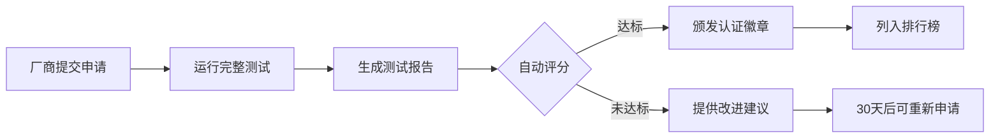

# OpenNL2SQL-Bench：新一代NL2SQL行业基准测试框架
# 产品设计方案 v2.1

> **文档版本**: v2.1 (2025-12-30)
> **版本说明**: 基于v2.0优化，新增JMeter启发的轻量化厂商接入设计（零代码集成），解决Token消耗与详细计时获取方案

---

## 目录

1. [产品愿景与战略定位](#1-产品愿景与战略定位)
2. [核心功能设计](#2-核心功能设计)
3. [技术架构设计](#3-技术架构设计)
4. [实施路线图（增量MVP策略）](#4-实施路线图增量mvp策略)
5. [关键工程设计](#5-关键工程设计)
6. [生态建设与认证体系](#6-生态建设与认证体系)
7. [风险评估与缓解措施](#7-风险评估与缓解措施)

---

## 1. 产品愿景与战略定位

### 1.1 愿景

成为全球公认的、**面向生产环境**的NL2SQL（ChatBI/DataAgent）产品能力评估的**"事实标准"**，类似于数据库领域的TPC-H、TPC-DS，为技术选型、产品研发和行业竞争提供客观、公正、可复现的度量衡。

### 1.2 定位

- **对行业**：一个开源、中立、科学的第三方测评基准
- **对厂商**：一套用于自我迭代、能力证明和市场竞争的"标尺"
- **对用户**：一份用于产品选型、技术评估和预算规划的"测试指南"
- **对社区**：一个可持续演进、共建共享的开放生态

### 1.3 解决的核心痛点

| 痛点 | 现状问题 | 我们的解决方案 |
|------|---------|--------------|
| **1. 评估失真** | 学术基准（Spider, BIRD）使用理想化、静态数据集，无法反映真实企业数据环境中的质量参差不齐、命名不规范、文档缺失等问题 | **质量分层测试**：提供高/中/低三层质量表结构（80/15/5），评估系统在真实脏数据下的鲁棒性 |
| **2. 维度单一** | 仅关注"SQL生成准确率"，忽略生产系统的响应性能、计算成本、并发能力、用户体验 | **六维评估体系**：准确度、性能、成本、鲁棒性、用户体验、并发稳定性 |
| **3. 标准缺失** | 缺乏统一的、可重复的、覆盖全链路的测试框架，厂商宣传口径不一，用户难以横向对比 | **标准化流程**：配置驱动、自动化执行、统一报告格式、可复现的数据生成 |
| **4. SQL等价性难题** | 同一问题可能对应多条语法不同但结果等价的SQL，简单文本匹配无法准确评估 | **结果集对比**：执行SQL后对比实际结果集，而非文本匹配，支持行无序、浮点容差等智能对比规则 |
| **5. 生产场景缺失** | 忽略并发、混合负载、长时稳定性等企业级场景 | **压力测试模块**：Locust集成，支持混合负载、阶梯加压、长时稳定性测试 |

---

## 2. 核心功能设计

### 2.1 动态、分层的测试数据生态

这是本框架区别于所有现有基准的**基石**。

#### 2.1.1 可控随机数据生成引擎

**核心特性**：
- **版本化种子管理**：每个数据集版本使用固定种子，确保绝对可复现
- **YAML配置驱动**：定义业务实体、关系、数据分布（正态/均匀/枚举）
- **支持大规模生成**：主外键约束完整、数据类型精确、业务逻辑一致

**种子管理策略**：
```yaml
seed_strategy:
  mode: "versioned"  # 每个版本固定种子
  seeds:
    v0.1: 42          # MVP版本
    v0.2: 12345       # Beta版本
    v1.0: 67890       # 正式版本

  # 分领域种子（可选，用于A/B测试）
  domain_seeds:
    ecommerce: 1001
    finance: 1002
    healthcare: 1003
```

#### 2.1.2 表结构质量分层系统（8:1.5:0.5黄金比例）

根据**命名规范、注释完整性、结构设计**三个维度，将表结构明确定义为三个质量等级：

| 质量等级 | 占比 | 命名规范 | 注释完整性 | 结构设计 | 示例（表名：用户订单） |
|---------|-----|---------|-----------|---------|---------------------|
| **高质量** | 80% | 业务语义清晰，蛇形命名法 | 表和所有字段均有详细中英文注释 | 主外键、索引、数据类型定义清晰 | `customer_order` (客户订单)<br/>`order_amount DECIMAL(10,2)` (订单金额) |
| **中等质量** | 15% | 存在合理缩写，语义基本可推断 | 关键表和复杂字段有注释，部分缺失 | 有基本约束，但可能类型不精确 | `cust_order` (客户订单)<br/>`ord_amt` (订单金额) |
| **低质量** | 5% | 无意义缩写、拼音首字母或技术性命名 | 几乎无注释 | 设计缺陷：缺外键、字段冗余、类型滥用 | `tbl_001` (表001)<br/>`col_a` (字段A)<br/>`je` (金额) |

**质量降级规则示例**：
```yaml
# 高质量表定义
tables:
  - name: customer_orders
    quality: high
    columns:
      - name: order_id
        type: BIGINT
        comment: "订单唯一标识，主键，自增"
      - name: customer_id
        type: BIGINT
        comment: "客户ID，外键关联customers表"

# 系统自动生成中等质量版本
# 自动降级规则：
# - 表名缩写：customer_orders -> cust_ord
# - 去除50%列注释
# - 保留关键业务字段注释

# 系统自动生成低质量版本
# 自动降级规则：
# - 表名编号化：customer_orders -> tbl_co_001
# - 列名拼音化/编号化：customer_id -> khid 或 col_001
# - 移除所有注释
# - 类型可能降级：DECIMAL -> VARCHAR
```

---

### 2.2 系统化题库与黄金答案管理

#### 2.2.1 题库元数据管理

**核心改进**：引入结构化元数据，支持智能筛选和自动验证

**题目定义格式（YAML）**：
```yaml
id: ecommerce_L3_001
version: "1.0"
domain: ecommerce
complexity: L3
question:
  en: "Calculate the total order amount for each customer"
  zh: "统计每个用户的订单总金额"

golden_sql: |
  SELECT
    u.user_id,
    u.name,
    SUM(o.amount) as total_amount
  FROM users u
  LEFT JOIN orders o ON u.user_id = o.user_id
  GROUP BY u.user_id, u.name
  ORDER BY total_amount DESC

# 依赖关系（自动验证）
dependencies:
  tables: [users, orders]
  features: [JOIN, GROUP BY, SUM, ORDER BY]
  min_data_rows:  # 最小数据量要求
    users: 10
    orders: 50

# 质量变体配置
quality_variants:
  high: auto      # 自动适配高质量表
  medium: auto    # 自动适配中等质量表
  low: manual     # 低质量表可能需要手动调整SQL（因表名/列名差异）
  low_sql: |      # 可选：为低质量表提供专门的SQL
    SELECT col_001, col_002, SUM(col_005) FROM tbl_001 t1
    LEFT JOIN tbl_002 t2 ON t1.col_001 = t2.col_003
    GROUP BY col_001, col_002

# 标签系统（支持智能筛选）
tags: [aggregation, join, basic, finance]

# 预期结果约束
expected_constraints:
  row_count_range: [1, 10000]   # 预期结果行数范围
  column_count: 3                # 预期列数
  data_types: [BIGINT, VARCHAR, DECIMAL]

# 对比规则（覆盖默认规则）
comparison_rules:
  row_order_matters: false       # 行顺序不重要
  column_order_matters: true     # 列顺序重要
  float_tolerance: 1e-2          # 金额计算容忍0.01
  null_handling: strict          # NULL值严格对比

# 元信息
metadata:
  author: "test_team"
  created_at: "2025-01-01"
  difficulty: "medium"
  estimated_time_ms: 500
```

#### 2.2.2 领域与复杂度设计

**领域覆盖**：
- **Phase 1**：电商（E-commerce）
- **Phase 2**：金融（Finance）、物流（Logistics）
- **Phase 3**：医疗（Healthcare）、人力资源（HR）

**复杂度层级（L1-L6）**：

| 层级 | 名称 | SQL特征 | 示例 | Phase 1目标题数 |
|-----|------|---------|------|---------------|
| **L1** | 单表简单筛选 | `SELECT ... WHERE` | 查询所有活跃用户 | 5 |
| **L2** | 单表聚合分组 | `GROUP BY, HAVING, COUNT/SUM/AVG` | 统计每日订单数 | 5 |
| **L3** | 多表关联 | `JOIN (INNER/LEFT/RIGHT)` | 查询用户及其订单 | 10 |
| **L4** | 嵌套子查询 | `IN/EXISTS/NOT IN` 子查询 | 查询订单金额高于平均值的客户 | 5 |
| **L5** | 窗口函数 | `ROW_NUMBER/RANK/LAG/LEAD` | 计算用户月度排名 | 3 |
| **L6** | 混合复杂查询 | 综合以上所有 | 分析用户生命周期价值 | 2 |
| **总计** | - | - | - | **30题（MVP）** |

**长期目标**：每个领域99题（L1-L6全覆盖）

#### 2.2.3 黄金答案生成与存储

**生成流程**：
1. 在指定质量层级的数据集上执行 `golden_sql`
2. 将结果集转换为 Apache Arrow Table
3. 存储为 Parquet 格式（列式压缩，精确类型保留）
4. 计算结果集哈希，用于快速验证完整性

**存储结构**：
```
data/golden_answers/
├── v0.1/                          # 数据集版本
│   ├── ecommerce/
│   │   ├── high/                  # 高质量表
│   │   │   ├── ecommerce_L1_001.parquet
│   │   │   ├── ecommerce_L1_001.meta.json  # 元信息（行数、列数、哈希）
│   │   │   └── ...
│   │   ├── medium/                # 中等质量表
│   │   └── low/                   # 低质量表
│   └── finance/
└── v0.2/
```

---

### 2.3 六维全链路评估体系

#### 核心改进：从"四维"扩展为"六维"

| 维度 | 指标 | 计算方法 | 业务价值 |
|-----|------|---------|---------|
| **1. 准确度 (Accuracy)** | 准确率 | (完全匹配题目数 / 总题目数) × 100% | **决定性指标**：系统是否真正理解问题 |
| **2. 性能 (Performance)** | 平均响应时间<br/>P50/P95/P99分位数 | 细粒度计时（NL2SQL、SQL生成、执行） | **用户满意度**：系统响应速度 |
| **3. 成本 (Cost)** | Token消耗<br/>美元成本 | 每题平均Token × 单价 | **经济性**：大规模使用的预算 |
| **4. 鲁棒性 (Robustness)** | 鲁棒性系数 | (低质量准确度 / 高质量准确度) × 100% | **适应性**：对脏数据的容忍度 |
| **5. 用户体验 (UX)** | TTFB、错误清晰度 | 首次响应延迟、错误信息可读性评分 | **可用性**：真实用户感知 |
| **6. 并发稳定性 (Concurrency)** | QPS、错误率、稳定性 | 压测场景下的吞吐量与失败率 | **生产可用性**：企业级负载能力 |

#### 2.3.1 准确度评估：智能结果集对比

**核心挑战**：不同数据库的类型系统差异、浮点精度、NULL处理、字符串编码

**解决方案：分层对比策略**

```python
class ResultComparator:
    """
    三层对比策略：
    1. Schema对比：列数、列名、列类型（带容忍度）
    2. Row对比：行数、行顺序（支持无序对比）
    3. Value对比：
       - 数值类型：相对误差 < 1e-6（可配置）
       - 字符串：去除首尾空格后对比
       - 日期时间：统一转UTC后对比
       - NULL：严格对比
    """

    def compare(self, golden: pd.DataFrame, actual: pd.DataFrame,
                rules: ComparisonRules) -> ComparisonResult:
        # 1. Schema检查
        if not self._compare_schema(golden, actual, rules):
            return ComparisonResult(match=False, reason="Schema mismatch")

        # 2. Row数量检查
        if len(golden) != len(actual):
            return ComparisonResult(match=False, reason=f"Row count mismatch: {len(golden)} vs {len(actual)}")

        # 3. 数据对比（支持行无序）
        if not rules.row_order_matters:
            golden = self._normalize_row_order(golden)
            actual = self._normalize_row_order(actual)

        # 4. 逐值对比
        return self._compare_values(golden, actual, rules)
```

**对比规则配置（comparison_rules.yaml）**：
```yaml
default_rules:
  row_order_matters: true
  column_order_matters: true
  float_tolerance: 1e-6
  null_handling: strict
  string_normalization: trim  # trim | lower | none

# 针对特定题目的覆盖规则
question_overrides:
  ecommerce_L3_001:  # 聚合查询，行顺序不重要
    row_order_matters: false

  finance_L5_002:    # 金额计算，容忍更大误差
    float_tolerance: 1e-2

# 针对特定数据库的适配规则
database_adaptations:
  clickhouse:
    # ClickHouse的Float64与MySQL的DOUBLE精度差异
    float_tolerance: 1e-5

  postgresql:
    # PostgreSQL的NUMERIC类型处理
    numeric_as_decimal: true
```

#### 2.3.2 性能评估：多次运行取中位数

**性能计时准确性改进**：

**问题**：网络延迟、GC、系统负载都会影响计时

**解决方案**：
```python
class PerformanceProfiler:
    def profile_query(self, sut: SUTAdapter, question: str,
                      repetitions: int = 5) -> PerformanceMetrics:
        """
        多次运行策略：
        1. Warm-up: 运行2次预热（不计入统计）
        2. Measurement: 运行5次，去掉最高和最低，取中位数
        3. 可选：记录每个阶段的CPU/内存使用情况
        """
        # Warm-up
        for _ in range(2):
            sut.query(question)

        # Measurement
        timings = []
        for _ in range(repetitions):
            start = time.perf_counter_ns()
            result = sut.query(question)
            end = time.perf_counter_ns()
            timings.append((end - start) / 1_000_000)  # 转换为毫秒

        # 去掉最高和最低，计算中位数
        timings_trimmed = sorted(timings)[1:-1]
        median_time = statistics.median(timings_trimmed)

        return PerformanceMetrics(
            median_time_ms=median_time,
            p50=statistics.median(timings),
            p95=self._percentile(timings, 0.95),
            p99=self._percentile(timings, 0.99),
            measurements=timings
        )
```

**性能报告示例**：
```
性能剖析结果：
├── NL2SQL转换时长: 234ms (中位数), P95: 312ms, P99: 456ms
├── SQL生成时长:    123ms (中位数), P95: 178ms, P99: 234ms
├── SQL执行时长:    567ms (中位数), P95: 789ms, P99: 1023ms
└── 端到端总时长:    924ms (中位数), P95: 1234ms, P99: 1678ms

📊 性能分布：
  Min: 856ms  |  P50: 924ms  |  P95: 1234ms  |  P99: 1678ms  |  Max: 1892ms
  ▁▂▃▅▇█▇▅▃▂▁  （5次测量的分布直方图）
```

#### 2.3.3 用户体验 (UX) 评估（新增）

**核心指标**：

1. **TTFB (Time To First Byte)**：首次响应延迟
   - 对流式系统特别重要
   - 目标：< 500ms

2. **渐进式信息披露质量**：
   - 评估系统是否给出中间状态（如"正在分析表结构..."）
   - 使用LLM评估中间提示的友好性

3. **错误信息清晰度**：
   ```python
   class ErrorClarityEvaluator:
       def evaluate_error_message(self, error_msg: str) -> float:
           """
           使用LLM评估错误信息的用户友好度（0-1分）

           评估维度：
           - 是否包含具体错误原因
           - 是否提供修复建议
           - 语言是否通俗易懂（非技术黑话）
           - 是否包含示例
           """
           prompt = f"""
           评估以下错误信息的用户友好度（0-1分）：

           错误信息：
           {error_msg}

           评估标准：
           1. 明确指出错误原因（0.3分）
           2. 提供修复建议（0.3分）
           3. 语言通俗易懂（0.2分）
           4. 包含示例或引导（0.2分）

           只返回数值分数。
           """
           return self.llm.evaluate(prompt)
   ```

**好的错误信息示例**：
```
❌ 糟糕的错误信息：
"Query failed: NullPointerException at line 234"

✅ 优秀的错误信息：
"无法找到表 'customer_orders'。
可能原因：
1. 表名拼写错误（您是否想查询 'customers' 表？）
2. 该表在当前数据库中不存在

建议：请使用 SHOW TABLES 查看可用表列表。"
```

#### 2.3.4 鲁棒性评估扩展

**扩展评估场景**：

```yaml
robustness_scenarios:
  # 现有：表结构质量
  schema_quality: [high, medium, low]

  # 新增1：数据分布异常
  data_distribution:
    - normal          # 正态分布
    - skewed          # 严重倾斜（如1%用户占80%订单）
    - sparse          # 稀疏（大量空表/空值）
    - edge_cases      # 边界情况（超大数值、超长字符串）

  # 新增2：问题表述变化
  question_phrasing:
    - standard        # 标准提问："统计每个用户的订单数"
    - ambiguous       # 模糊提问："最近的订单"（最近是指多久？）
    - typo            # 拼写错误："订dan总额"
    - colloquial      # 口语化："看看哪个客户买东西最多"
    - multilingual    # 跨语言：同一题目的中英文版本

  # 新增3：Schema复杂度
  schema_complexity:
    - simple          # 5张表以内
    - medium          # 10-20张表
    - complex         # 50+张表（模拟真实企业）
```

**鲁棒性评分公式**：
```python
robustness_score = (
    0.4 * (low_quality_accuracy / high_quality_accuracy) +  # 质量容忍度
    0.3 * (skewed_data_accuracy / normal_data_accuracy) +   # 数据分布容忍度
    0.2 * (ambiguous_question_accuracy / standard_accuracy) + # 模糊问题容忍度
    0.1 * (complex_schema_accuracy / simple_schema_accuracy)  # 复杂度容忍度
) * 100%
```

---

### 2.4 自动化测试执行引擎

#### 2.4.1 增强的数据库适配器设计

```python
class DatabaseAdapter(ABC):
    """数据库适配器基类 - 增强版"""

    @abstractmethod
    def execute_query(self, sql: str, timeout_ms: int = 30000) -> ResultSet:
        """执行查询，返回标准化结果集"""
        pass

    @abstractmethod
    def get_schema_info(self, include_stats: bool = False) -> SchemaInfo:
        """
        获取表结构信息

        返回：
        - 表名、列名、列类型
        - 注释（如果存在）
        - 索引信息
        - 可选：表统计信息（行数、数据大小）
        """
        pass

    @abstractmethod
    def normalize_result(self, raw_result) -> pd.DataFrame:
        """
        标准化结果集（关键！）

        处理：
        - 类型转换：DECIMAL -> float64, DATETIME -> datetime64
        - 列名大小写统一
        - NULL值处理
        - 时区转换（统一为UTC）
        """
        pass

    @abstractmethod
    def get_explain_plan(self, sql: str) -> ExecutionPlan:
        """
        获取执行计划（用于性能分析）

        挑战：不同数据库的EXPLAIN格式差异巨大
        需要统一抽象为：
        - 扫描行数
        - 索引使用情况
        - JOIN类型
        - 预估成本
        """
        pass

    @abstractmethod
    def get_database_version(self) -> str:
        """获取数据库版本（用于兼容性报告）"""
        pass

    # 新增：数据库特性检测
    def supports_feature(self, feature: DatabaseFeature) -> bool:
        """
        检测数据库是否支持特定SQL特性

        示例：
        - WINDOW_FUNCTIONS: 窗口函数支持
        - CTE: 公共表表达式
        - JSON_FUNCTIONS: JSON函数
        - FULL_OUTER_JOIN: 全外连接
        """
        return feature in self.supported_features
```

**特定数据库适配器示例**：

```python
class ClickHouseAdapter(DatabaseAdapter):
    """ClickHouse适配器 - 处理OLAP特性"""

    def normalize_result(self, raw_result) -> pd.DataFrame:
        """
        ClickHouse特殊处理：
        - Float64精度差异
        - DateTime时区处理
        - Nullable类型转换
        """
        df = pd.DataFrame(raw_result)

        # 处理Nullable类型
        for col in df.columns:
            if df[col].dtype == 'object' and 'Nullable' in str(df[col].dtype):
                df[col] = df[col].replace({None: np.nan})

        return df

    def get_explain_plan(self, sql: str) -> ExecutionPlan:
        """
        ClickHouse的EXPLAIN格式转换为统一格式

        ClickHouse: EXPLAIN PLAN
        MySQL: EXPLAIN
        PostgreSQL: EXPLAIN (FORMAT JSON)
        """
        raw_plan = self.execute(f"EXPLAIN PLAN {sql}")
        return self._parse_clickhouse_plan(raw_plan)
```

#### 2.4.2 增强的SUT（被测系统）适配器

**支持流式模式**：

```python
@dataclass
class NL2SQLResponse:
    generated_sql: str
    result_dataframe: pd.DataFrame
    nl2sql_time_ms: float
    sql_execution_time_ms: float
    token_count: int
    error: Optional[str] = None

    # 新增：流式响应元数据
    ttfb_ms: Optional[float] = None  # Time To First Byte
    streaming_chunks: Optional[List[str]] = None  # 流式块记录

class SUTAdapter(ABC):
    @abstractmethod
    async def query(self,
                    question: str,
                    schema_info: SchemaInfo,
                    mode: Literal["sync", "stream"] = "sync"
                   ) -> Union[NL2SQLResponse, AsyncIterator[NL2SQLResponse]]:
        """
        支持两种模式：
        - sync: 等待完整SQL生成（传统模式）
        - stream: 流式返回（模拟真实用户体验，可测TTFB）

        流式模式示例：
        async for chunk in sut.query(question, schema, mode="stream"):
            print(f"收到块：{chunk.streaming_chunks[-1]}")
            if chunk.ttfb_ms:
                print(f"TTFB: {chunk.ttfb_ms}ms")
        """
        pass
```

**实现示例**：

```python
class OpenAIAdapter(SUTAdapter):
    """OpenAI GPT-4 适配器"""

    async def query(self, question: str, schema_info: SchemaInfo,
                    mode: Literal["sync", "stream"] = "sync") -> NL2SQLResponse:
        start_time = time.perf_counter_ns()
        ttfb = None
        chunks = []

        if mode == "stream":
            stream = await openai.ChatCompletion.acreate(
                model="gpt-4",
                messages=[...],
                stream=True
            )

            async for chunk in stream:
                if ttfb is None:
                    ttfb = (time.perf_counter_ns() - start_time) / 1_000_000
                chunks.append(chunk.choices[0].delta.content)

            sql = "".join(chunks)
        else:
            response = await openai.ChatCompletion.acreate(...)
            sql = response.choices[0].message.content

        # 执行SQL并返回结果
        result_df = self.db_adapter.execute_query(sql)

        return NL2SQLResponse(
            generated_sql=sql,
            result_dataframe=result_df,
            nl2sql_time_ms=(time.perf_counter_ns() - start_time) / 1_000_000,
            ttfb_ms=ttfb,
            streaming_chunks=chunks if mode == "stream" else None
        )
```

---

### 2.5 轻量化厂商接入设计（JMeter启发）

#### 核心设计理念

**借鉴JMeter的成功经验**：JMeter能够成为API压测的事实标准，核心在于**零代码接入** + **可选深度定制**。我们采用相同策略，确保厂商接入成本极低，同时支持高级定制。

**三级集成策略**：

| 集成级别 | 耗时 | 适用场景 | 集成成本 | 指标完整度 |
|---------|------|---------|---------|----------|
| **Level 1: 零代码集成** | 5-10分钟 | 已有REST API的系统 | 填写配置文件 | 基础指标（准确率、端到端性能） |
| **Level 2: 标准格式** | 15-30分钟 | 愿意调整响应格式的系统 | 调整API返回格式 | 完整指标（含Token、详细计时） |
| **Level 3: 深度集成** | 1-2小时 | 开源系统或深度合作 | 实现Python SDK适配器 | 完整指标 + 内部埋点 |

---

#### 2.5.1 Level 1：零代码HTTP通用适配器

**目标**：厂商无需修改任何代码，只需提供现有API的文档

**核心技术**：JSONPath映射 + 智能降级

##### 配置示例：

```yaml
# my_chatbi_adapter.yaml
sut_adapter:
  type: http_generic
  name: "我的ChatBI系统"
  version: "1.0.0"

  # API端点配置
  endpoint:
    url: "https://your-chatbi.com/api/v1/query"
    method: POST
    headers:
      Authorization: "Bearer ${CHATBI_API_KEY}"  # 支持环境变量
      Content-Type: "application/json"

  # 请求映射（将框架标准格式映射到厂商格式）
  request_mapping:
    # 问题文本映射
    question: "$.query.text"                     # 框架的question → 厂商的query.text

    # Schema信息映射
    schema: "$.context.database_schema"          # 框架的schema → 厂商的context.database_schema

    # 可选：额外参数
    custom_params:
      database_type: "mysql"
      timeout_seconds: 30

  # 响应映射（从厂商格式提取框架需要的字段）
  response_mapping:
    # ===== 必需字段 =====
    success: "$.success"                         # 是否成功
    generated_sql: "$.data.sql"                  # 生成的SQL
    result_data: "$.data.result"                 # 结果数据

    # ===== 可选字段：Token消耗 =====
    token_usage:
      total_tokens: "$.usage.total_tokens"       # 总Token数
      input_tokens: "$.usage.input_tokens"       # 输入Token
      output_tokens: "$.usage.output_tokens"     # 输出Token

    # ===== 可选字段：详细计时 =====
    timing_breakdown:
      nl2sql_time_ms: "$.timing.nl2sql_conversion"      # NL理解和分析耗时
      sql_generation_time_ms: "$.timing.sql_generation" # SQL生成耗时
      sql_execution_time_ms: "$.timing.sql_execution"   # SQL执行耗时

    # ===== 可选字段：错误信息 =====
    error:
      message: "$.error.message"
      code: "$.error.code"
      details: "$.error.details"

  # 降级策略
  fallback:
    # 如果厂商不提供Token信息，标记为不可用
    token_unavailable_message: "厂商API未提供Token消耗数据"

    # 如果厂商不提供详细计时，使用客户端计时
    use_client_timing: true
```

##### 智能降级机制：

```python
class HTTPGenericAdapter(SUTAdapter):
    """HTTP通用适配器 - 零代码集成"""

    def __init__(self, config: Dict):
        self.config = config
        self.request_mapper = JSONPathMapper(config['request_mapping'])
        self.response_mapper = JSONPathMapper(config['response_mapping'])

    async def query(self, question: str, schema_info: SchemaInfo) -> NL2SQLResponse:
        # 1. 客户端计时开始（始终可用）
        client_timing = ClientTimer()
        client_timing.start()

        # 2. 构造请求
        request_body = self.request_mapper.map({
            'question': question,
            'schema': schema_info.to_dict()
        })

        # 3. 发送HTTP请求
        async with httpx.AsyncClient() as client:
            response = await client.post(
                self.config['endpoint']['url'],
                json=request_body,
                headers=self.config['endpoint']['headers'],
                timeout=30.0
            )

        # 4. 记录客户端计时
        client_timing.stop()
        ttfb = client_timing.get_ttfb()  # 首字节时间
        total_time = client_timing.get_total()  # 总时间

        # 5. 解析响应
        response_data = response.json()

        # 6. 提取字段（带降级策略）
        try:
            generated_sql = self.response_mapper.extract('generated_sql', response_data)
            result_data = self.response_mapper.extract('result_data', response_data)
            success = self.response_mapper.extract('success', response_data, default=True)
        except JSONPathExtractionError as e:
            raise AdapterError(f"必需字段提取失败: {e}")

        # 7. 提取可选字段 - Token消耗（降级）
        token_count = None
        token_breakdown = None
        try:
            total_tokens = self.response_mapper.extract('token_usage.total_tokens', response_data)
            input_tokens = self.response_mapper.extract('token_usage.input_tokens', response_data)
            output_tokens = self.response_mapper.extract('token_usage.output_tokens', response_data)

            token_count = total_tokens
            token_breakdown = {
                'input_tokens': input_tokens,
                'output_tokens': output_tokens,
                'total_tokens': total_tokens
            }
        except JSONPathExtractionError:
            logger.debug("厂商未提供Token消耗数据，标记为N/A")
            token_count = None  # 报告中将显示"N/A"

        # 8. 提取可选字段 - 详细计时（降级到客户端计时）
        timing_source = "client"  # 默认使用客户端计时
        nl2sql_time_ms = None
        sql_generation_time_ms = None
        sql_execution_time_ms = None

        try:
            nl2sql_time_ms = self.response_mapper.extract('timing_breakdown.nl2sql_time_ms', response_data)
            sql_generation_time_ms = self.response_mapper.extract('timing_breakdown.sql_generation_time_ms', response_data)
            sql_execution_time_ms = self.response_mapper.extract('timing_breakdown.sql_execution_time_ms', response_data)
            timing_source = "vendor"  # 厂商提供了详细计时
        except JSONPathExtractionError:
            logger.debug("厂商未提供详细计时数据，使用客户端计时")
            # 降级：只有端到端总时间
            nl2sql_time_ms = None
            sql_generation_time_ms = None
            sql_execution_time_ms = None

        # 9. 返回标准化响应
        return NL2SQLResponse(
            generated_sql=generated_sql,
            result_dataframe=self._parse_result_data(result_data),

            # 性能指标
            nl2sql_time_ms=nl2sql_time_ms,
            sql_generation_time_ms=sql_generation_time_ms,
            sql_execution_time_ms=sql_execution_time_ms,
            total_time_ms=total_time,  # 客户端计时（始终可用）
            ttfb_ms=ttfb,  # 客户端计时（始终可用）

            # Token消耗
            token_count=token_count,
            token_breakdown=token_breakdown,

            # 元信息
            timing_source=timing_source,  # "vendor" 或 "client"
            token_available=(token_count is not None)
        )
```

##### 交互式配置生成器：

```bash
$ onb adapter create

欢迎使用OpenNL2SQL-Bench厂商接入配置生成器！

让我们通过几个问题快速生成配置文件：

📍 步骤 1/5: 基本信息
-------------------
系统名称: 我的ChatBI
版本号: 1.0.0
API端点: https://my-chatbi.com/api/query

📍 步骤 2/5: 发送测试请求
-------------------
正在发送测试请求到您的API...

检测到响应格式：
{
  "success": true,
  "data": {
    "sql": "SELECT * FROM users",
    "result": [...]
  },
  "usage": {
    "total_tokens": 123
  }
}

📍 步骤 3/5: 自动映射字段
-------------------
✅ 检测到SQL字段: $.data.sql
✅ 检测到结果字段: $.data.result
✅ 检测到Token字段: $.usage.total_tokens
⚠️  未检测到详细计时字段（将使用客户端计时）

📍 步骤 4/5: 确认配置
-------------------
生成的配置文件：
[显示YAML配置]

是否正确？(y/n): y

📍 步骤 5/5: 运行测试
-------------------
正在运行快速测试（5道题）...

✅ 5/5 题目成功
   - 准确率: 80% (4/5)
   - 平均响应时间: 1,234ms
   - Token消耗: 可用 ✓

配置文件已保存到: my_chatbi_adapter.yaml
您现在可以运行完整测试：

  onb test run --sut-config my_chatbi_adapter.yaml --domain ecommerce
```

---

#### 2.5.2 Level 2：标准响应格式（推荐）

**目标**：厂商稍微调整API响应格式，遵循我们的标准，获得完整指标

**标准请求格式**：

```json
POST /api/nl2sql/query

{
  "question": "统计每个用户的订单总金额",
  "schema": {
    "database": "ecommerce_test",
    "tables": [
      {
        "name": "users",
        "columns": [
          {"name": "user_id", "type": "BIGINT", "comment": "用户ID"},
          {"name": "name", "type": "VARCHAR(100)", "comment": "用户姓名"}
        ]
      },
      {
        "name": "orders",
        "columns": [
          {"name": "order_id", "type": "BIGINT"},
          {"name": "user_id", "type": "BIGINT"},
          {"name": "amount", "type": "DECIMAL(10,2)", "comment": "订单金额"}
        ]
      }
    ]
  },
  "config": {
    "database_type": "mysql",
    "timeout_ms": 30000
  }
}
```

**标准响应格式**：

```json
{
  "success": true,

  // ===== 必需字段 =====
  "generated_sql": "SELECT u.user_id, u.name, SUM(o.amount) as total FROM users u LEFT JOIN orders o ON u.user_id = o.user_id GROUP BY u.user_id, u.name",

  "result": {
    "columns": ["user_id", "name", "total"],
    "rows": [
      [1, "Alice", 1250.50],
      [2, "Bob", 890.00]
    ]
  },

  // ===== 可选但推荐字段 =====
  "execution_time_ms": {
    "nl2sql_conversion": 234,     // NL理解和Schema分析耗时
    "sql_generation": 123,         // SQL生成耗时
    "sql_execution": 567,          // SQL执行耗时
    "total": 924                   // 总时长（应等于上述之和）
  },

  "token_usage": {
    "input_tokens": 456,
    "output_tokens": 123,
    "total_tokens": 579
  },

  // ===== 可选：其他元信息 =====
  "confidence": 0.95,              // 可选：置信度
  "model_version": "gpt-4-turbo",  // 可选：使用的模型版本

  // ===== 错误情况 =====
  // 如果 success = false，需提供：
  "error": {
    "code": "SCHEMA_NOT_FOUND",
    "message": "无法找到表 'customer_orders'。\n可能原因：\n1. 表名拼写错误（您是否想查询 'customers' 表？）\n2. 该表不存在\n\n建议：使用 SHOW TABLES 查看可用表。",
    "details": {
      "searched_table": "customer_orders",
      "available_tables": ["customers", "orders", "products"]
    }
  }
}
```

**Level 2配置文件**（简化版）：

```yaml
sut_adapter:
  type: rest_api_standard
  base_url: "https://your-api.com/v1"
  endpoint: "/nl2sql/query"
  auth:
    type: bearer_token
    token: "${YOUR_API_KEY}"
  timeout_ms: 30000
```

**好处**：
- ✅ 配置文件极简（5行）
- ✅ 自动获取完整指标（Token、详细计时）
- ✅ 错误信息自动评分（UX指标）
- ✅ 支持流式响应（如果厂商实现）

---

#### 2.5.3 Level 3：Python SDK深度集成（可选）

**目标**：开源系统或深度合作厂商，通过SDK获取内部埋点数据

**适配器实现示例**：

```python
from onb.adapters.sut.base import SUTAdapter, NL2SQLResponse
from onb.core.types import SchemaInfo
import pandas as pd

class MyNL2SQLAdapter(SUTAdapter):
    """您的NL2SQL系统适配器"""

    def __init__(self, config: dict):
        super().__init__(config)
        # 初始化您的SDK客户端
        self.client = YourSDK(
            api_key=config['api_key'],
            endpoint=config['endpoint']
        )

    async def query(self, question: str, schema_info: SchemaInfo,
                    mode: str = "sync") -> NL2SQLResponse:
        """
        执行NL2SQL查询

        Args:
            question: 自然语言问题
            schema_info: 数据库Schema信息
            mode: "sync" 或 "stream"

        Returns:
            NL2SQLResponse 对象
        """
        import time
        start_time = time.perf_counter_ns()

        # 调用您的SDK（可以获取内部详细指标）
        result = await self.client.nl2sql_with_metrics(
            question=question,
            schema=self._schema_info_to_dict(schema_info),
            return_metrics=True  # 返回内部埋点数据
        )

        end_time = time.perf_counter_ns()
        elapsed_ms = (end_time - start_time) / 1_000_000

        # 转换为DataFrame
        df = pd.DataFrame(result['rows'], columns=result['columns'])

        return NL2SQLResponse(
            generated_sql=result['sql'],
            result_dataframe=df,

            # 详细计时（从SDK获取）
            nl2sql_time_ms=result['metrics']['nl2sql_time_ms'],
            sql_generation_time_ms=result['metrics']['sql_generation_time_ms'],
            sql_execution_time_ms=result['metrics']['sql_execution_time_ms'],
            total_time_ms=elapsed_ms,

            # Token消耗（从SDK获取）
            token_count=result['metrics']['total_tokens'],
            token_breakdown={
                'input_tokens': result['metrics']['input_tokens'],
                'output_tokens': result['metrics']['output_tokens']
            },

            # 元信息
            timing_source="vendor",  # 厂商内部埋点
            token_available=True
        )

    def _schema_info_to_dict(self, schema_info: SchemaInfo) -> dict:
        """将SchemaInfo转换为您的SDK所需格式"""
        return {
            'database': schema_info.database_name,
            'tables': [
                {
                    'name': table.name,
                    'columns': [
                        {
                            'name': col.name,
                            'type': col.type,
                            'comment': col.comment
                        }
                        for col in table.columns
                    ]
                }
                for table in schema_info.tables
            ]
        }
```

**SDK配置文件**：

```yaml
sut_adapter:
  type: python_sdk
  class: "my_nl2sql_adapter.MyNL2SQLAdapter"  # 模块.类名
  config:
    api_key: "${YOUR_API_KEY}"
    endpoint: "https://your-service.com"
    enable_internal_metrics: true  # 启用内部埋点
```

---

#### 2.5.4 Token消耗与详细计时的获取策略总结

**Token消耗获取**：

| 集成级别 | Token获取方式 | 可用性 | 准确性 |
|---------|-------------|-------|-------|
| **Level 1** | JSONPath从响应中提取（如果厂商提供） | 可选 | 高（厂商提供） |
| **Level 2** | 标准字段`token_usage` | 推荐 | 高（厂商提供） |
| **Level 3** | SDK直接返回或tiktoken估算 | 必需 | 非常高（内部计数） |
| **降级** | 标记为"N/A"，不影响准确率评估 | - | - |

**详细响应时间获取**：

| 集成级别 | 计时方式 | 可用性 | 准确性 |
|---------|---------|-------|-------|
| **Level 1** | 客户端计时（TTFB、总时长）+ JSONPath提取详细计时（可选） | 客户端始终可用，详细计时可选 | 客户端：中；详细计时：高 |
| **Level 2** | 客户端计时 + 标准字段`execution_time_ms` | 推荐 | 高（厂商提供） |
| **Level 3** | SDK返回内部埋点数据 | 必需 | 非常高（内部计时） |
| **降级** | 仅客户端端到端计时 | 始终可用 | 中等（网络延迟影响） |

**报告中的展示**：

```
━━━━━━━━━━━━━━━━━━━━━━━━━━━━━━━━━━━━━━━━━━━━━━━━━━━━
  性能剖析结果（我的ChatBI）
━━━━━━━━━━━━━━━━━━━━━━━━━━━━━━━━━━━━━━━━━━━━━━━━━━━━

📊 响应时间分析
├── 端到端总时长: 924ms (客户端计时) ✓
├── TTFB (首字节): 89ms (客户端计时) ✓
└── 详细分阶段计时:
    ├── NL2SQL转换: 234ms (厂商上报) ✓✓
    ├── SQL生成: 123ms (厂商上报) ✓✓
    └── SQL执行: 567ms (厂商上报) ✓✓

💰 Token消耗
├── 输入Token: 456 (厂商上报) ✓✓
├── 输出Token: 123 (厂商上报) ✓✓
├── 总Token: 579 (厂商上报) ✓✓
└── 预估成本: $0.0173 (基于GPT-4定价)

📝 图例
- ✓✓ = 厂商提供（高可信度）
- ✓  = 客户端计时/框架估算（参考价值）
- N/A = 数据不可用
```

**关键设计原则**：

1. **渐进式增强**：Level 1提供基础能力，Level 2/3逐步增强
2. **智能降级**：缺少可选字段不影响测试进行
3. **透明标注**：报告中明确标注数据来源和可信度
4. **零代码优先**：大多数厂商通过Level 1即可接入
5. **JMeter精神**：配置文件驱动，交互式生成器辅助

---

### 2.6 并发压测模块（Locust集成）

#### 2.6.1 核心设计

**目标**：评估系统在企业级并发场景下的**吞吐量、稳定性、资源消耗**

**技术选型**：Locust（Python原生，易于扩展自定义场景）

#### 2.6.2 压测场景定义

```python
from locust import HttpUser, task, between, constant_pacing

class NL2SQLUser(HttpUser):
    """模拟真实用户的查询行为"""

    # 思考时间：1-3秒随机间隔（模拟用户输入问题的时间）
    wait_time = between(1, 3)

    def on_start(self):
        """用户初始化：加载题库"""
        self.questions = self.load_questions()
        self.simple_questions = [q for q in self.questions if q.complexity in ['L1', 'L2']]
        self.complex_questions = [q for q in self.questions if q.complexity in ['L3', 'L4', 'L5', 'L6']]

    @task(70)  # 70%权重 - 简单查询
    def simple_query(self):
        question = random.choice(self.simple_questions)
        with self.client.post("/api/nl2sql",
                              json={"question": question.text, "schema": self.schema},
                              catch_response=True) as response:
            if response.status_code == 200:
                result = response.json()
                if self.validate_result(result, question):
                    response.success()
                else:
                    response.failure("Result mismatch")
            else:
                response.failure(f"HTTP {response.status_code}")

    @task(30)  # 30%权重 - 复杂分析
    def complex_query(self):
        question = random.choice(self.complex_questions)
        # 类似simple_query，但超时时间更长
        with self.client.post("/api/nl2sql",
                              json={"question": question.text},
                              timeout=10,
                              catch_response=True) as response:
            # ... 处理逻辑
            pass
```

#### 2.6.3 压测场景配置（YAML）

```yaml
scenario_name: "标准企业负载"
description: "模拟100个并发用户，混合简单查询和复杂分析"

load_profile:
  users: 100              # 并发用户数
  spawn_rate: 10          # 每秒启动10个用户（10秒达到满载）
  duration: 1800          # 持续30分钟

query_distribution:
  simple: 0.7             # 70% L1-L2
  complex: 0.3            # 30% L3-L6

performance_sla:
  # 性能服务级别协议
  p95_response_time_ms: 3000   # P95响应时间 < 3秒
  p99_response_time_ms: 5000   # P99响应时间 < 5秒
  error_rate_max: 0.01         # 错误率 < 1%
  min_qps: 80                  # 最低QPS = 80

stability_test:
  # 长时稳定性测试
  enabled: true
  duration: 7200          # 2小时持续压力
  check_memory_leak: true # 监控内存泄漏
  check_cpu_spike: true   # 监控CPU尖峰

ramp_up_test:
  # 阶梯加压测试
  enabled: true
  steps:
    - users: 50
      duration: 300       # 5分钟
    - users: 100
      duration: 300
    - users: 200
      duration: 300
    - users: 500
      duration: 300
  # 绘制性能拐点曲线，找到系统崩溃临界点
```

#### 2.6.4 压测报告示例

```
━━━━━━━━━━━━━━━━━━━━━━━━━━━━━━━━━━━━━━━━━━━━━━━━━━━━
  并发压力测试报告
━━━━━━━━━━━━━━━━━━━━━━━━━━━━━━━━━━━━━━━━━━━━━━━━━━━━

📊 测试配置
├── 场景名称: 标准企业负载
├── 并发用户: 100
├── 测试时长: 30分钟
└── 查询分布: 70%简单 / 30%复杂

📈 性能指标
├── QPS (平均):           152 queries/sec
├── 响应时间 (平均):      824ms
├── 响应时间 (P95):       2,345ms  ✅ 达标 (SLA: <3000ms)
├── 响应时间 (P99):       3,890ms  ✅ 达标 (SLA: <5000ms)
└── 错误率:               0.3%     ✅ 达标 (SLA: <1%)

🎯 准确性（压测期间）
├── 总请求数:             273,600
├── 成功请求:             272,780
├── 结果正确:             271,234  (99.4%)
└── 结果错误:             1,546    (0.6%)

🔥 稳定性分析
├── 内存使用:             稳定 (2.3GB → 2.5GB, 无泄漏)
├── CPU使用:              稳定 (45% ± 5%)
└── 性能衰减:             无明显衰减

⚠️  发现问题
1. 在200并发时，P99响应时间超过5秒 (6.2秒)
2. 复杂查询（L6）的错误率偏高 (2.1%)

💡 建议
- 优化L6复杂查询的SQL生成逻辑
- 考虑增加数据库连接池大小
- 建议生产环境并发上限：180用户
```

---

## 3. 技术架构设计

### 3.1 总体架构图（更新版）

```
┌──────────────────────────────────────────────────────────────────┐
│                   CLI Console (Typer + Rich)                      │
│  onb init | generate | test | benchmark | report                 │
└────────────────────────────────┬─────────────────────────────────┘
                                 │
┌────────────────────────────────▼─────────────────────────────────┐
│              Test Orchestration & Reporting Layer                 │
│  ┌─────────────┐  ┌──────────────┐  ┌─────────────────────────┐ │
│  │ Test Runner │  │ Metric       │  │ Report Generator        │ │
│  │ (Scheduler) │─▶│ Aggregator   │─▶│ (HTML/JSON/CSV)         │ │
│  └─────────────┘  └──────────────┘  └─────────────────────────┘ │
└────────────────────────────────┬─────────────────────────────────┘
                                 │
┌────────────────────────────────▼─────────────────────────────────┐
│                    Core Evaluation Engine                         │
│  ┌─────────────────┐  ┌─────────────────┐  ┌─────────────────┐  │
│  │ Result          │  │ Performance     │  │ UX Evaluator    │  │
│  │ Comparator      │  │ Profiler        │  │ (TTFB/Error)    │  │
│  │ (智能对比)       │  │ (多次取中位)     │  │                 │  │
│  └─────────────────┘  └─────────────────┘  └─────────────────┘  │
│  ┌─────────────────┐  ┌─────────────────┐  ┌─────────────────┐  │
│  │ Token Counter   │  │ Robustness      │  │ Concurrency     │  │
│  │                 │  │ Analyzer        │  │ Tester (Locust) │  │
│  └─────────────────┘  └─────────────────┘  └─────────────────┘  │
└────────────────────────────────┬─────────────────────────────────┘
                                 │
         ┌───────────────────────┼───────────────────────┐
         │                       │                       │
┌────────▼────────┐   ┌──────────▼────────┐   ┌─────────▼────────┐
│ Data Generator  │   │ Question Bank     │   │ Test Agent       │
│ & Schema Mgr    │   │ & Golden Answers  │   │ & Adapters       │
├─────────────────┤   ├───────────────────┤   ├──────────────────┤
│ • 质量分层       │   │ • YAML元数据      │   │ • DB Adapter     │
│ • 版本化种子     │   │ • Parquet存储     │   │ • SUT Adapter    │
│ • Faker引擎     │   │ • 依赖验证        │   │ • 流式支持       │
└─────────────────┘   └───────────────────┘   └──────────────────┘
         │                       │                       │
         ▼                       ▼                       ▼
  (YAML配置)             (题库+黄金答案)            (插件化)
```

### 3.2 核心技术栈

| 组件 | 技术选择 | 版本要求 | 理由 |
|------|---------|---------|------|
| **开发语言** | Python | 3.10+ | 生态丰富，数据处理能力强，AI集成便利 |
| **项目管理** | Poetry | 1.5+ | 依赖管理清晰，虚拟环境隔离，现代化 |
| **配置管理** | YAML + Pydantic | Pydantic 2.0+ | 类型安全的配置验证，自动文档生成 |
| **数据生成** | Faker + 自研引擎 | Faker 19+ | 支持中文业务场景，可控随机生成 |
| **数据库适配** | SQLAlchemy | 2.0+ | 统一ORM接口，支持OLTP/OLAP，类型映射完善 |
| **结果存储** | Parquet (PyArrow) | PyArrow 12+ | 高效列式存储，精确类型保留，压缩率高 |
| **并发压测** | Locust | 2.15+ | Python原生，易于扩展自定义场景，分布式支持 |
| **CLI框架** | Typer + Rich | Typer 0.9+ | 现代化命令行体验，美观输出，自动补全 |
| **报告生成** | Jinja2 + Plotly | Plotly 5.14+ | 交互式HTML报告，可导出静态图 |
| **测试框架** | Pytest | 7.4+ | 标准Python测试工具，丰富插件生态 |
| **异步支持** | asyncio + aiohttp | Python 3.10+ | 支持流式SUT适配器，提升并发性能 |

### 3.3 数据库支持矩阵

| 数据库 | 引擎驱动 | 优先级 | 关键特性支持 | 备注 |
|--------|---------|--------|------------|------|
| **MySQL** | PyMySQL | P0 (MVP-0) | 基础SQL、JOIN、子查询 | 最广泛OLTP |
| **PostgreSQL** | psycopg3 | P0 (MVP-1) | 窗口函数、CTE、JSON | 企业级OLTP |
| **ClickHouse** | clickhouse-driver | P1 (Phase 2) | OLAP聚合、物化视图 | 实时分析 |
| **Apache Doris** | PyMySQL (MySQL协议) | P1 (Phase 2) | MPP、向量化执行 | 国产OLAP |
| **StarRocks** | PyMySQL (MySQL协议) | P2 (Phase 3) | 实时数仓 | 性能优化 |

### 3.4 目录结构（最终版）

```
open-nl2sql-bench/
├── pyproject.toml                  # Poetry配置
├── README.md                       # 项目说明
├── CLAUDE.md                       # Claude Code指导文档
├── LICENSE                         # Apache 2.0
├── IMPLEMENTATION_PLAN.md          # 实施计划（MVP分阶段）
│
├── onb/                            # 主包 (Open NL2SQL Bench)
│   ├── __init__.py
│   ├── cli/                        # CLI命令
│   │   ├── __init__.py
│   │   ├── main.py                 # 主入口
│   │   ├── init.py                 # onb init
│   │   ├── generate.py             # onb generate
│   │   ├── test.py                 # onb test
│   │   ├── benchmark.py            # onb benchmark
│   │   └── report.py               # onb report
│   │
│   ├── core/                       # 核心抽象
│   │   ├── types.py                # 类型定义
│   │   ├── config.py               # 配置管理
│   │   └── exceptions.py           # 异常定义
│   │
│   ├── data/                       # 数据生成模块
│   │   ├── generator.py            # 数据生成器
│   │   ├── schema_manager.py       # Schema管理
│   │   ├── quality_transformer.py  # 质量降级器
│   │   └── faker_providers.py      # 自定义Faker Provider
│   │
│   ├── questions/                  # 题库管理
│   │   ├── loader.py               # 题目加载器
│   │   ├── validator.py            # 题目验证器
│   │   ├── golden_generator.py     # 黄金答案生成器
│   │   └── metadata.py             # 元数据管理
│   │
│   ├── adapters/                   # 适配器
│   │   ├── database/               # 数据库适配器
│   │   │   ├── base.py             # 抽象基类
│   │   │   ├── mysql.py
│   │   │   ├── postgresql.py
│   │   │   ├── clickhouse.py
│   │   │   └── normalizer.py       # 结果标准化器
│   │   └── sut/                    # 被测系统适配器
│   │       ├── base.py
│   │       ├── rest_api.py
│   │       ├── python_sdk.py
│   │       └── openai_adapter.py   # 示例实现
│   │
│   ├── evaluation/                 # 评估引擎
│   │   ├── comparator.py           # 结果对比器
│   │   ├── profiler.py             # 性能剖析器
│   │   ├── token_counter.py        # Token计数器
│   │   ├── robustness.py           # 鲁棒性分析器
│   │   ├── ux_evaluator.py         # 用户体验评估器（新增）
│   │   └── metrics.py              # 指标计算
│   │
│   ├── benchmark/                  # 压测模块
│   │   ├── locust_scenarios.py     # Locust场景
│   │   ├── load_tester.py          # 负载测试器
│   │   └── stability_analyzer.py   # 稳定性分析器
│   │
│   ├── reporting/                  # 报告生成
│   │   ├── generator.py            # 报告生成器
│   │   ├── templates/              # Jinja2模板
│   │   │   ├── report.html.j2
│   │   │   └── benchmark.html.j2
│   │   └── visualizations.py       # Plotly图表
│   │
│   └── utils/                      # 工具模块
│       ├── logger.py               # 日志
│       ├── timer.py                # 计时器
│       └── validators.py           # 通用验证器
│
├── tests/                          # 测试套件
│   ├── unit/                       # 单元测试
│   ├── integration/                # 集成测试
│   └── e2e/                        # 端到端测试
│
├── examples/                       # 示例配置
│   ├── schemas/                    # Schema示例
│   │   └── ecommerce.yaml
│   ├── questions/                  # 题库示例
│   │   └── ecommerce_mvp.yaml
│   ├── sut_configs/                # SUT配置示例
│   │   ├── openai_gpt4.yaml
│   │   └── custom_adapter.yaml
│   └── benchmark_scenarios/        # 压测场景
│       └── standard_load.yaml
│
├── data/                           # 运行时数据（不纳入Git）
│   ├── datasets/                   # 生成的数据集
│   │   └── v0.1/
│   │       └── ecommerce/
│   │           ├── high/
│   │           ├── medium/
│   │           └── low/
│   ├── golden_answers/             # 黄金答案
│   │   └── v0.1/
│   └── reports/                    # 测试报告
│
├── docs/                           # 文档
│   ├── architecture.md             # 架构设计
│   ├── sut_integration_guide.md    # 厂商接入指南（重要！）
│   ├── question_contribution.md    # 题库贡献指南
│   └── api_reference.md            # API文档
│
└── scripts/                        # 工具脚本
    ├── init_database.sh            # 初始化数据库
    └── validate_questions.py       # 题库验证脚本
```

---

## 4. 实施路线图（增量MVP策略）

### 核心改进：采用"三阶段MVP"降低风险

**传统问题**：Phase 1 计划4-6周完成太多功能，风险高

**新策略**：将Phase 1拆分为3个小MVP，每个2周，快速验证核心假设

---

### MVP-0：最小可验证原型（Week 1-2）

**目标**：验证"结果集对比"这一核心假设是否可行

**范围**：
- ✅ 单个领域（电商）
- ✅ 5-10道题（仅L1-L3）
- ✅ 仅MySQL支持
- ✅ **硬编码的数据**（暂不做随机生成）
- ✅ 基础准确度评估
- ❌ 不包含：质量分层、性能计时、Token统计、压测

**交付物**：
```bash
# 能够运行的最小命令
onb test run \
  --sut-config examples/mock_sut.yaml \
  --questions examples/questions/ecommerce_mvp0.yaml \
  --database mysql://localhost/ecommerce_hardcoded

# 输出简单文本报告
准确率: 8/10 (80%)
失败题目: ecommerce_L2_003, ecommerce_L3_005
```

**成功标准**：
1. 结果集对比逻辑正确（能识别正确/错误答案）
2. 至少支持1个Mock SUT适配器
3. 能生成基础文本报告

**风险**：如果结果集对比在实际中不可行（例如浮点精度问题无法解决），则需要重新设计评估策略

---

### MVP-1：数据生成与扩展题库（Week 3-5）

**目标**：在MVP-0基础上，添加数据生成引擎和扩展题库

**新增功能**：
- ✅ 数据生成引擎（**单一质量层级**，暂不分层）
- ✅ 扩展到30道题（L1-L6全覆盖）
- ✅ 添加性能计时（基础版，单次运行）
- ✅ 支持自定义SUT适配器（REST API）

**仍不包含**：
- ❌ 质量分层
- ❌ Token统计
- ❌ 压测

**交付物**：
```bash
# 1. 生成数据
onb generate data --schema examples/schemas/ecommerce.yaml --seed 42

# 2. 生成黄金答案
onb generate golden --questions examples/questions/ecommerce_30.yaml

# 3. 运行测试
onb test run \
  --sut-url http://my-nl2sql-api.com/query \
  --questions examples/questions/ecommerce_30.yaml \
  --output reports/mvp1_result.json

# 输出JSON报告
{
  "accuracy": 0.867,
  "avg_response_time_ms": 1234,
  "failed_questions": ["ecommerce_L6_001", ...]
}
```

**成功标准**：
1. 数据生成可复现（同一seed生成相同数据）
2. 30道题全部有黄金答案
3. 能对接真实的NL2SQL系统（通过REST API）

---

### MVP-2：完整Phase 1（Week 6-10）

**目标**：实现完整的基础评估能力

**新增功能**：
- ✅ **三层质量分级**（高/中/低）
- ✅ **鲁棒性评估**（对比三层质量下的准确率）
- ✅ Token统计（集成tiktoken）
- ✅ 性能剖析增强（多次运行取中位数）
- ✅ 基础CLI和HTML报告

**交付物**：
```bash
# 完整测试流程
onb test run \
  --sut-config examples/sut_configs/openai_gpt4.yaml \
  --domain ecommerce \
  --quality all \  # 测试所有质量层级
  --output reports/phase1_complete.html

# 生成完整HTML报告（包含图表）
```

**成功标准**：
1. 能够评估系统在三个质量层级下的表现
2. 生成专业的HTML报告（包含雷达图、分位数图）
3. 鲁棒性系数计算正确

**Alpha版本发布**：面向早期用户测试

---

### Phase 2：产品化与多维度评估（Week 11-18，共8周）

**Week 11-13**：多维度评估
- ✅ 用户体验指标（TTFB、错误清晰度）
- ✅ 鲁棒性扩展（数据分布异常、模糊问题）
- ✅ 复杂度雷达图优化

**Week 14-16**：生态扩展
- ✅ PostgreSQL、ClickHouse适配器
- ✅ 新增2个领域（金融、物流）
- ✅ SUT适配器增强（流式支持）
- ✅ 编写厂商接入指南文档

**Week 17-18**：压测模块
- ✅ Locust场景集成
- ✅ 标准负载场景库
- ✅ 性能监控与稳定性分析

**Beta版本发布**：
- 发布数据集 v0.1（3个领域 × 30题）
- 邀请种子厂商参与测试
- 收集反馈并迭代

---

### Phase 3：生态建设与标准确立（Week 19+，持续）

**Week 19-24**：认证体系
- ✅ 建立Bronze/Silver/Gold/Platinum认证等级
- ✅ 官方认证徽章生成
- ✅ 季度排行榜系统

**Week 25-30**：多语言支持
- ✅ 题库中英双语版本
- ✅ 跨语言鲁棒性评估
- ✅ 国际化文档

**Week 31+**：社区与生态
- ✅ 官方网站与文档站
- ✅ 公开成绩榜单
- ✅ 社区题库贡献机制
- ✅ 年度NL2SQL挑战赛
- ✅ 行业合作与商业认证

**1.0正式版发布**：
- 完整的5个领域题库（每个99题）
- 支持5+数据库
- 完善的认证体系
- 活跃的社区生态

---

### 并行任务：双轨制开发

**主线（Core Framework）**：
```
Week 1-2:   MVP-0（核心验证）
Week 3-5:   MVP-1（数据生成+题库）
Week 6-10:  MVP-2（质量分层+完整评估）
Week 11-18: Phase 2（多维度+生态扩展）
Week 19+:   Phase 3（认证+国际化）
```

**辅线（Community Assets）并行进行**：
```
Week 1-6:   5个领域的Schema设计（YAML）
Week 5-10:  电商领域99题完整题库
Week 7-14:  金融、物流领域题库（各99题）
Week 11-18: 医疗、人力领域题库（各99题）
Week 15+:   社区题库贡献与审核流程
```

**好处**：
- 框架开发不被题库建设阻塞
- 可以提前邀请领域专家贡献题库
- MVP阶段只需要30题，降低初期工作量

---

### 里程碑时间线可视化

```
时间轴 (周)
│
├─ Week 1-2   ███ MVP-0: 最小可验证原型
│             验证核心假设：结果集对比是否可行
│
├─ Week 3-5   ████ MVP-1: 数据生成+扩展题库
│             可对接真实NL2SQL系统
│
├─ Week 6-10  ██████ MVP-2: 完整基础能力
│             ▶ Alpha版本发布
│             质量分层、鲁棒性评估、HTML报告
│
├─ Week 11-18 ████████ Phase 2: 产品化
│             ▶ Beta版本发布 + 数据集v0.1
│             多数据库、多领域、压测模块
│
└─ Week 19+   ████████████████ Phase 3: 生态建设
              ▶ 1.0正式版发布
              认证体系、多语言、社区运营

📦 数据集发布计划：
├─ v0.1 (Week 10):  电商30题 + MySQL
├─ v0.2 (Week 18):  3领域×30题 + 3数据库
└─ v1.0 (Week 30+): 5领域×99题 + 5数据库
```

---

## 5. 关键工程设计

### 5.1 结果集对比引擎（核心模块）

**配置文件：comparison_rules.yaml**

```yaml
# 默认对比规则
default_rules:
  row_order_matters: true
  column_order_matters: true
  float_tolerance: 1e-6
  decimal_places: 6
  null_handling: strict  # strict | lenient
  string_normalization: trim  # trim | lower | none
  datetime_tolerance_ms: 0

# 针对特定数据库的适配规则
database_adaptations:
  mysql:
    # MySQL的FLOAT精度问题
    float_tolerance: 1e-5

  clickhouse:
    # ClickHouse的DateTime时区问题
    datetime_normalize_timezone: "UTC"
    float_tolerance: 1e-5

  postgresql:
    # PostgreSQL的NUMERIC类型
    numeric_as_decimal: true

# 针对特定题目的覆盖规则（优先级最高）
question_overrides:
  ecommerce_L3_001:
    row_order_matters: false  # 聚合查询，行顺序不重要
    float_tolerance: 1e-2     # 金额计算，容忍更大误差

  finance_L5_003:
    row_order_matters: false
    float_tolerance: 1e-4     # 金融计算，精度要求较高

# 数据类型特定规则
type_specific_rules:
  FLOAT:
    comparison_mode: relative_error  # relative_error | absolute_error
    tolerance: 1e-6

  DECIMAL:
    comparison_mode: absolute_error
    tolerance: 0.01

  VARCHAR:
    case_sensitive: false
    trim_whitespace: true

  DATETIME:
    normalize_timezone: true
    tolerance_ms: 1000  # 容忍1秒误差（处理时区转换）
```

**对比算法实现**：

```python
class ResultComparator:
    """智能结果集对比器"""

    def __init__(self, rules: ComparisonRules):
        self.rules = rules

    def compare(self, golden: pd.DataFrame, actual: pd.DataFrame) -> ComparisonResult:
        """
        三层对比：
        1. Schema对比
        2. Row对比
        3. Value对比
        """
        # 1. Schema检查
        schema_match = self._compare_schema(golden, actual)
        if not schema_match.success:
            return ComparisonResult(
                match=False,
                reason=f"Schema mismatch: {schema_match.details}"
            )

        # 2. Row数量检查
        if len(golden) != len(actual):
            return ComparisonResult(
                match=False,
                reason=f"Row count mismatch: {len(golden)} vs {len(actual)}"
            )

        # 3. 数据对比（支持行无序）
        if not self.rules.row_order_matters:
            golden = self._normalize_row_order(golden)
            actual = self._normalize_row_order(actual)

        # 4. 逐值对比
        for idx, (golden_row, actual_row) in enumerate(zip(golden.itertuples(), actual.itertuples())):
            value_match = self._compare_row(golden_row, actual_row, golden.dtypes)
            if not value_match.success:
                return ComparisonResult(
                    match=False,
                    reason=f"Value mismatch at row {idx}: {value_match.details}"
                )

        return ComparisonResult(match=True, reason="Exact match")

    def _compare_row(self, golden_row, actual_row, dtypes) -> MatchResult:
        """逐列对比（类型感知）"""
        for col_idx, (col_name, dtype) in enumerate(dtypes.items(), start=1):
            golden_val = golden_row[col_idx]
            actual_val = actual_row[col_idx]

            # NULL值对比
            if pd.isna(golden_val) or pd.isna(actual_val):
                if pd.isna(golden_val) and pd.isna(actual_val):
                    continue
                else:
                    return MatchResult(success=False, details=f"NULL mismatch in {col_name}")

            # 类型特定对比
            if dtype in [np.float32, np.float64]:
                if not self._compare_float(golden_val, actual_val):
                    return MatchResult(success=False,
                                      details=f"Float mismatch in {col_name}: {golden_val} vs {actual_val}")

            elif dtype == np.object_:  # 字符串
                if not self._compare_string(golden_val, actual_val):
                    return MatchResult(success=False,
                                      details=f"String mismatch in {col_name}: '{golden_val}' vs '{actual_val}'")

            elif 'datetime' in str(dtype):
                if not self._compare_datetime(golden_val, actual_val):
                    return MatchResult(success=False,
                                      details=f"DateTime mismatch in {col_name}")

            else:  # 其他类型（整数等）
                if golden_val != actual_val:
                    return MatchResult(success=False,
                                      details=f"Value mismatch in {col_name}: {golden_val} vs {actual_val}")

        return MatchResult(success=True)

    def _compare_float(self, a: float, b: float) -> bool:
        """浮点数对比（支持相对误差和绝对误差）"""
        if self.rules.float_comparison_mode == "relative_error":
            # 相对误差: |a - b| / max(|a|, |b|) < tolerance
            max_val = max(abs(a), abs(b))
            if max_val == 0:
                return abs(a - b) < self.rules.float_tolerance
            return abs(a - b) / max_val < self.rules.float_tolerance
        else:
            # 绝对误差: |a - b| < tolerance
            return abs(a - b) < self.rules.float_tolerance

    def _compare_string(self, a: str, b: str) -> bool:
        """字符串对比（支持归一化）"""
        if self.rules.string_normalization == "trim":
            a, b = a.strip(), b.strip()
        elif self.rules.string_normalization == "lower":
            a, b = a.lower().strip(), b.lower().strip()

        if not self.rules.string_case_sensitive:
            a, b = a.lower(), b.lower()

        return a == b

    def _compare_datetime(self, a: pd.Timestamp, b: pd.Timestamp) -> bool:
        """日期时间对比（支持时区归一化和容差）"""
        if self.rules.datetime_normalize_timezone:
            a = a.tz_convert('UTC')
            b = b.tz_convert('UTC')

        diff_ms = abs((a - b).total_seconds() * 1000)
        return diff_ms <= self.rules.datetime_tolerance_ms

    def _normalize_row_order(self, df: pd.DataFrame) -> pd.DataFrame:
        """
        对行进行排序（用于无序对比）

        策略：
        1. 按所有列排序（字典序）
        2. 重置索引
        """
        return df.sort_values(by=list(df.columns)).reset_index(drop=True)
```

---

### 5.2 性能剖析器（多次运行取中位数）

```python
@dataclass
class PerformanceMetrics:
    """性能指标"""
    median_time_ms: float
    mean_time_ms: float
    p50: float
    p95: float
    p99: float
    min_time_ms: float
    max_time_ms: float
    std_dev: float
    measurements: List[float]

    # 分阶段耗时
    nl2sql_time_ms: Optional[float] = None
    sql_generation_time_ms: Optional[float] = None
    sql_execution_time_ms: Optional[float] = None

class PerformanceProfiler:
    """性能剖析器 - 多次运行消除噪音"""

    def __init__(self, warmup_runs: int = 2, measurement_runs: int = 5):
        self.warmup_runs = warmup_runs
        self.measurement_runs = measurement_runs

    def profile_query(self, sut: SUTAdapter, question: str,
                      schema_info: SchemaInfo) -> PerformanceMetrics:
        """
        多次运行策略：
        1. Warm-up: 运行N次预热（不计入统计）
        2. Measurement: 运行M次，去掉最高和最低，计算统计量
        """
        logger.info(f"Performance profiling: {self.warmup_runs} warmup + {self.measurement_runs} measurements")

        # 1. Warm-up（预热JIT编译、缓存等）
        for i in range(self.warmup_runs):
            logger.debug(f"Warmup run {i+1}/{self.warmup_runs}")
            try:
                sut.query(question, schema_info)
            except Exception as e:
                logger.warning(f"Warmup run failed: {e}")

        # 2. Measurement runs
        timings = []
        for i in range(self.measurement_runs):
            logger.debug(f"Measurement run {i+1}/{self.measurement_runs}")

            start = time.perf_counter_ns()
            try:
                result = sut.query(question, schema_info)
                end = time.perf_counter_ns()

                elapsed_ms = (end - start) / 1_000_000
                timings.append(elapsed_ms)

                logger.debug(f"Run {i+1} time: {elapsed_ms:.2f}ms")
            except Exception as e:
                logger.error(f"Measurement run failed: {e}")
                # 失败的运行不计入统计

        if len(timings) < 3:
            raise ValueError(f"Too few successful measurements: {len(timings)}/{self.measurement_runs}")

        # 3. 计算统计量
        timings_sorted = sorted(timings)

        # 去掉最高和最低（Trimmed Mean）
        if len(timings) >= 5:
            timings_trimmed = timings_sorted[1:-1]
        else:
            timings_trimmed = timings_sorted

        return PerformanceMetrics(
            median_time_ms=statistics.median(timings),
            mean_time_ms=statistics.mean(timings_trimmed),
            p50=self._percentile(timings, 0.50),
            p95=self._percentile(timings, 0.95),
            p99=self._percentile(timings, 0.99),
            min_time_ms=min(timings),
            max_time_ms=max(timings),
            std_dev=statistics.stdev(timings) if len(timings) > 1 else 0,
            measurements=timings
        )

    def _percentile(self, data: List[float], p: float) -> float:
        """计算百分位数"""
        sorted_data = sorted(data)
        index = int(len(sorted_data) * p)
        return sorted_data[min(index, len(sorted_data) - 1)]
```

---

### 5.3 厂商接入指南（Phase 1必须完成）

**文档：docs/sut_integration_guide.md**

```markdown
# OpenNL2SQL-Bench 被测系统接入指南

本指南帮助NL2SQL系统厂商快速接入OpenNL2SQL-Bench评测框架。

---

## 方式1：REST API 集成（推荐）

### 1.1 实现标准API端点

您的系统需要提供一个HTTP POST端点，接收自然语言问题并返回SQL及执行结果。

**端点URL示例**：`https://your-api.com/v1/nl2sql/query`

**请求格式**：
json
POST /v1/nl2sql/query
Content-Type: application/json

{
  "question": "统计每个用户的订单总金额",
  "schema": {
    "database": "ecommerce_test",
    "tables": [
      {
        "name": "users",
        "columns": [
          {"name": "user_id", "type": "BIGINT", "comment": "用户ID"},
          {"name": "name", "type": "VARCHAR(100)", "comment": "用户姓名"}
        ]
      },
      {
        "name": "orders",
        "columns": [
          {"name": "order_id", "type": "BIGINT"},
          {"name": "user_id", "type": "BIGINT"},
          {"name": "amount", "type": "DECIMAL(10,2)", "comment": "订单金额"}
        ]
      }
    ]
  },
  "config": {
    "database_type": "mysql",  // mysql | postgresql | clickhouse
    "timeout_ms": 30000
  }
}


**响应格式**：
json
{
  "success": true,
  "generated_sql": "SELECT u.user_id, u.name, SUM(o.amount) as total FROM users u LEFT JOIN orders o ON u.user_id = o.user_id GROUP BY u.user_id, u.name",
  "execution_time_ms": {
    "nl2sql_conversion": 234,    // NL到SQL转换耗时
    "sql_generation": 123,        // SQL生成耗时
    "sql_execution": 567,         // SQL执行耗时
    "total": 924                  // 总耗时
  },
  "token_usage": {
    "input_tokens": 456,
    "output_tokens": 123,
    "total_tokens": 579
  },
  "result": {
    "columns": ["user_id", "name", "total"],
    "rows": [
      [1, "Alice", 1250.50],
      [2, "Bob", 890.00]
    ]
  },
  "confidence": 0.95  // 可选：置信度
}


**错误响应**：
json
{
  "success": false,
  "error": {
    "code": "SCHEMA_NOT_FOUND",
    "message": "无法找到表 'customer_orders'。可能原因：1. 表名拼写错误 2. 该表不存在。建议：使用 SHOW TABLES 查看可用表。",
    "details": {...}
  }
}


### 1.2 配置文件示例

创建 `my_system.yaml`：

yaml
sut_adapter:
  type: rest_api
  base_url: "https://your-api.com/v1"
  endpoint: "/nl2sql/query"
  auth:
    type: bearer_token  # bearer_token | api_key | none
    token: "${YOUR_API_KEY}"  # 支持环境变量
  timeout_ms: 30000
  retry:
    max_attempts: 3
    backoff_multiplier: 2


### 1.3 运行测试

bash
# 使用您的配置运行测试
onb test run \
  --sut-config my_system.yaml \
  --domain ecommerce \
  --quality all \
  --output reports/my_system_report.html


---

## 方式2：Python SDK 集成

### 2.1 实现适配器类

python
from onb.adapters.sut.base import SUTAdapter, NL2SQLResponse
from onb.core.types import SchemaInfo
import pandas as pd

class MyNL2SQLAdapter(SUTAdapter):
    """您的NL2SQL系统适配器"""

    def __init__(self, config: dict):
        super().__init__(config)
        # 初始化您的SDK客户端
        self.client = YourSDK(api_key=config['api_key'])

    async def query(self, question: str, schema_info: SchemaInfo,
                    mode: str = "sync") -> NL2SQLResponse:
        """
        执行NL2SQL查询

        Args:
            question: 自然语言问题
            schema_info: 数据库Schema信息
            mode: "sync" 或 "stream"

        Returns:
            NL2SQLResponse 对象
        """
        import time
        start_time = time.perf_counter_ns()

        # 调用您的SDK
        result = self.client.nl2sql(
            question=question,
            schema=self._schema_info_to_dict(schema_info)
        )

        end_time = time.perf_counter_ns()
        elapsed_ms = (end_time - start_time) / 1_000_000

        # 转换为DataFrame
        df = pd.DataFrame(result['rows'], columns=result['columns'])

        return NL2SQLResponse(
            generated_sql=result['sql'],
            result_dataframe=df,
            nl2sql_time_ms=elapsed_ms,
            sql_execution_time_ms=result.get('execution_time_ms', 0),
            token_count=result.get('token_count', 0)
        )

    def _schema_info_to_dict(self, schema_info: SchemaInfo) -> dict:
        """将SchemaInfo转换为您的SDK所需格式"""
        return {
            'database': schema_info.database_name,
            'tables': [...]
        }


### 2.2 注册适配器

创建 `my_adapter_config.yaml`：

yaml
sut_adapter:
  type: python_sdk
  class: "my_nl2sql_adapter.MyNL2SQLAdapter"  # 模块.类名
  config:
    api_key: "${YOUR_API_KEY}"
    endpoint: "https://your-service.com"


### 2.3 运行测试

bash
onb test run \
  --sut-config my_adapter_config.yaml \
  --domain ecommerce


---

## 常见问题

### Q1: 如何处理流式响应？

如果您的系统支持流式输出SQL（SSE、WebSocket等），请在REST API响应中逐步返回：

json
// 第一个chunk
{"chunk": "SELECT ", "ttfb_ms": 123}

// 第二个chunk
{"chunk": "u.user_id, u.name ", "ttfb_ms": 123}

// 最后一个chunk
{"chunk": "GROUP BY u.user_id", "final": true, "ttfb_ms": 123}


或者在Python SDK中实现 `mode="stream"` 模式。

### Q2: 如何报告错误？

请在错误信息中包含：
1. 具体错误原因
2. 修复建议
3. 示例（如果适用）

示例：
json
{
  "error": {
    "message": "无法找到表 'customer_orders'。\n可能原因：\n1. 表名拼写错误（您是否想查询 'customers' 表？）\n2. 该表不存在\n\n建议：使用 SHOW TABLES 查看可用表。"
  }
}


### Q3: 支持哪些数据库？

目前支持：
- MySQL
- PostgreSQL
- ClickHouse
- Apache Doris
- StarRocks

更多数据库支持正在开发中。

---

## 技术支持

- GitHub Issues: https://github.com/open-nl2sql-bench/issues
- 邮件: support@opennl2sql.org
- 社区讨论: https://community.opennl2sql.org
```

---

## 6. 生态建设与认证体系

### 6.1 认证等级体系（Phase 3）

```yaml
certification_levels:
  Bronze:
    name: "铜牌认证"
    icon: "🥉"
    requirements:
      accuracy:
        threshold: 0.50
        description: "通过50%以上的基础题库（L1-L3）"
      performance: null  # 无要求
      domains: ["ecommerce"]  # 至少通过1个领域

    benefits:
      - "官方认证徽章（可嵌入官网）"
      - "列入公开排行榜"

    badge_html: |
      

  Silver:
    name: "银牌认证"
    icon: "🥈"
    requirements:
      accuracy:
        threshold: 0.70
        description: "通过70%完整题库（L1-L6）"
      performance:
        p95_response_time_ms: 3000  # P95 < 3秒
      robustness:
        min_score: 0.60  # 鲁棒性系数 > 60%
      domains: ["ecommerce", "finance"]  # 至少2个领域

    benefits:
      - "银色徽章"
      - "排行榜优先展示"
      - "技术白皮书引用"

  Gold:
    name: "金牌认证"
    icon: "🥇"
    requirements:
      accuracy:
        threshold: 0.85
      performance:
        p95_response_time_ms: 2000
        p99_response_time_ms: 5000
      robustness:
        min_score: 0.70
      concurrency:
        min_qps: 100
        error_rate_max: 0.01
      cost:
        avg_token_per_query: 3000  # 平均Token < 3000
      domains: ["ecommerce", "finance", "logistics"]  # 至少3个领域

    benefits:
      - "金色徽章"
      - "官方案例研究"
      - "合作伙伴计划资格"
      - "技术支持优先级"

  Platinum:
    name: "白金认证"
    icon: "💎"
    requirements:
      accuracy:
        threshold: 0.95
      performance:
        p95_response_time_ms: 1000
        p99_response_time_ms: 2000
      robustness:
        min_score: 0.80
      concurrency:
        min_qps: 200
        error_rate_max: 0.005
      cost:
        avg_token_per_query: 2000
      ux:
        ttfb_ms: 500
        error_clarity_score: 0.8
      domains: "all"  # 通过所有5个领域

    benefits:
      - "白金徽章"
      - "行业标杆案例"
      - "联合市场推广"
      - "年度最佳产品候选"
      - "技术委员会席位"
```

**认证流程**：



---

### 6.2 公开排行榜（Phase 3）

**排行榜设计**：

```
━━━━━━━━━━━━━━━━━━━━━━━━━━━━━━━━━━━━━━━━━━━━━━━━━━━━━━━━━━━━━━━━
  OpenNL2SQL-Bench 公开排行榜 (2025 Q1)
━━━━━━━━━━━━━━━━━━━━━━━━━━━━━━━━━━━━━━━━━━━━━━━━━━━━━━━━━━━━━━━━

排名  系统名称           认证等级  准确率  P95延迟  成本/题  鲁棒性  QPS
─────────────────────────────────────────────────────────────────
 1    System Alpha      💎        96.2%   890ms   $0.012   82%    234
 2    DataAgent Pro     🥇        87.5%   1,234ms $0.018   75%    156
 3    NL2SQL Cloud      🥇        85.1%   1,567ms $0.015   71%    142
 4    ChatBI Express    🥈        72.3%   2,345ms $0.025   65%    98
 5    QueryBot          🥉        58.7%   3,890ms $0.032   52%    67

📊 详细对比：
├─ 电商领域准确率:  Alpha 98% | Pro 89% | Cloud 87% | Express 75% | QueryBot 62%
├─ 金融领域准确率:  Alpha 95% | Pro 86% | Cloud 83% | Express 70% | QueryBot 55%
└─ 复杂查询(L6):    Alpha 92% | Pro 78% | Cloud 75% | Express 58% | QueryBot 42%

🔄 更新频率: 每季度更新一次
📅 下次更新: 2025-04-01
```

**排行榜页面功能**：
- 可按维度排序（准确率、性能、成本、鲁棒性）
- 可筛选领域（只看电商、只看金融等）
- 查看历史趋势（系统能力进步曲线）
- 下载完整对比报告（PDF）

---

### 6.3 多语言支持（Phase 3）

**跨语言鲁棒性评估**：

```yaml
# questions/ecommerce/bilingual_L2_001.yaml
id: ecommerce_L2_001_bilingual
version: "1.0"
domain: ecommerce
complexity: L2

question:
  en: "What is the average order amount per customer?"
  zh: "每个客户的平均订单金额是多少？"
  # 未来扩展：
  # ja: "各顧客の平均注文金額は？"
  # ko: "고객당 평균 주문 금액은 얼마입니까?"

golden_sql: |
  SELECT
    customer_id,
    AVG(order_amount) as avg_amount
  FROM orders
  GROUP BY customer_id

# 跨语言测试配置
multilingual_test:
  enabled: true
  expected_behavior: "same_sql"  # same_sql | same_result | equivalent
  # same_sql: 期望生成相同SQL
  # same_result: 期望结果集相同（SQL可以不同）
  # equivalent: 期望语义等价（更宽松）

tags: [aggregation, multilingual, basic]
```

**跨语言评估指标**：

```python
class MultilingualRobustnessAnalyzer:
    """跨语言鲁棒性分析器"""

    def analyze(self, questions: List[BilingualQuestion]) -> MultilingualReport:
        """
        评估指标：
        1. 语言一致性: 同一题目的中英文版本是否生成相同SQL
        2. 语言偏好: 系统在哪种语言下表现更好
        3. 跨语言准确率差异
        """
        results = {
            'en': {'accuracy': 0, 'total': 0},
            'zh': {'accuracy': 0, 'total': 0}
        }

        consistency_score = 0

        for question in questions:
            # 测试英文版本
            en_result = self.test_question(question.question['en'], question.golden_sql)
            results['en']['total'] += 1
            if en_result.correct:
                results['en']['accuracy'] += 1

            # 测试中文版本
            zh_result = self.test_question(question.question['zh'], question.golden_sql)
            results['zh']['total'] += 1
            if zh_result.correct:
                results['zh']['accuracy'] += 1

            # 语言一致性检查
            if en_result.generated_sql == zh_result.generated_sql:
                consistency_score += 1

        return MultilingualReport(
            en_accuracy=results['en']['accuracy'] / results['en']['total'],
            zh_accuracy=results['zh']['accuracy'] / results['zh']['total'],
            cross_language_consistency=consistency_score / len(questions),
            language_preference=self._detect_language_preference(results)
        )
```

---

### 6.4 反作弊机制与诚信体系（Phase 2-3）

#### 核心问题

Level 2/Level 3集成允许厂商自行上报Token消耗和详细计时数据，存在**数据造假风险**：
- 虚报Token消耗（夸大成本优势）
- 虚报响应时间（夸大性能优势）
- 针对公开题目硬编码答案
- 返回预计算结果绕过真实执行

**解决方案**：建立**多层防御体系**，让作弊的**收益 < 成本**

---

#### 6.4.1 技术验证层（自动检测）

**Level 1：客户端计时交叉验证**

```python
class FraudDetector:
    """作弊检测器"""

    def validate_timing(self, vendor_reported: TimingData,
                        client_measured: TimingData) -> ValidationResult:
        """验证厂商上报的时间与客户端计时是否一致"""

        # 规则1：总时间一致性检查
        vendor_total = (vendor_reported.nl2sql_time_ms +
                       vendor_reported.sql_generation_time_ms +
                       vendor_reported.sql_execution_time_ms)

        client_total = client_measured.total_time_ms

        # 容忍度：客户端计时包含网络延迟，允许±200ms误差
        if abs(vendor_total - client_total) > 200:
            return ValidationResult(
                passed=False,
                severity="HIGH",
                reason=f"厂商上报总时间({vendor_total}ms) 与客户端计时({client_total}ms) 差异过大",
                evidence={
                    'vendor_total': vendor_total,
                    'client_total': client_total,
                    'diff': abs(vendor_total - client_total)
                }
            )

        # 规则2：时间合理性检查
        if vendor_reported.nl2sql_time_ms < 10:  # 不可能少于10ms
            return ValidationResult(
                passed=False,
                severity="HIGH",
                reason=f"NL2SQL转换时间({vendor_reported.nl2sql_time_ms}ms) 不合理（过短）"
            )

        # 规则3：统计异常检测
        # 如果厂商的时间分布与历史数据偏离过大
        historical_avg = self.get_historical_average()
        if vendor_total < historical_avg * 0.3:  # 比历史平均快70%以上
            return ValidationResult(
                passed=False,
                severity="MEDIUM",
                reason=f"响应时间异常快速，疑似缓存预计算结果",
                suggestion="将触发随机题目验证"
            )

        return ValidationResult(passed=True)
```

**Level 2：Token消耗合理性验证**

```python
class TokenValidator:
    """Token消耗验证器"""

    def validate_token_usage(self, question: str, schema: SchemaInfo,
                             vendor_reported: TokenUsage) -> ValidationResult:
        """验证厂商上报的Token消耗是否合理"""

        # 方法1：使用tiktoken估算
        estimated_tokens = self.estimate_tokens(question, schema)

        # 容忍度：允许±30%误差（不同模型/Prompt策略会有差异）
        lower_bound = estimated_tokens * 0.7
        upper_bound = estimated_tokens * 1.3

        if not (lower_bound <= vendor_reported.total_tokens <= upper_bound):
            return ValidationResult(
                passed=False,
                severity="MEDIUM",
                reason=f"Token消耗({vendor_reported.total_tokens}) 超出合理范围",
                evidence={
                    'estimated': estimated_tokens,
                    'vendor_reported': vendor_reported.total_tokens,
                    'expected_range': f"{lower_bound}-{upper_bound}"
                }
            )

        # 方法2：统计学检测
        # 如果厂商上报的Token数总是比估算值低，疑似系统性虚报
        deviation_ratio = vendor_reported.total_tokens / estimated_tokens
        self.record_deviation(deviation_ratio)

        avg_deviation = self.get_average_deviation()
        if avg_deviation < 0.6:  # 平均只有估算值的60%，不合理
            return ValidationResult(
                passed=False,
                severity="HIGH",
                reason="Token消耗存在系统性低报，疑似造假",
                evidence={
                    'avg_deviation': avg_deviation,
                    'sample_size': self.get_sample_size()
                }
            )

        return ValidationResult(passed=True)
```

**Level 3：数据一致性检查**

```python
def validate_data_consistency(response: NL2SQLResponse) -> List[ValidationResult]:
    """检查厂商返回数据的内部一致性"""

    checks = []

    # 检查1：SQL是否真的被执行了
    if response.result_dataframe is not None:
        # 尝试重新执行厂商生成的SQL
        our_result = db_adapter.execute_query(response.generated_sql)

        if not results_match(our_result, response.result_dataframe):
            checks.append(ValidationResult(
                passed=False,
                severity="CRITICAL",
                reason="厂商返回的结果集与重新执行SQL的结果不一致",
                evidence="疑似返回预先计算的结果，而非真实执行SQL"
            ))

    # 检查2：时间分解是否合理
    if response.timing_breakdown:
        parts_sum = (response.nl2sql_time_ms +
                    response.sql_generation_time_ms +
                    response.sql_execution_time_ms)

        if abs(parts_sum - response.total_time_ms) > 50:  # 超过50ms误差
            checks.append(ValidationResult(
                passed=False,
                severity="MEDIUM",
                reason=f"时间分解不一致: {parts_sum}ms vs {response.total_time_ms}ms"
            ))

    # 检查3：Token分解是否合理
    if response.token_breakdown:
        if (response.token_breakdown['input_tokens'] +
            response.token_breakdown['output_tokens'] !=
            response.token_count):
            checks.append(ValidationResult(
                passed=False,
                severity="MEDIUM",
                reason="Token分解数据不一致"
            ))

    return checks
```

---

#### 6.4.2 盲测题库（防止针对公开题目优化）

**核心策略**：公开题库80% + 盲测题库20%

```yaml
# 测试策略配置
test_strategy:
  # 公开题库：用于厂商自测和开发
  public_questions:
    ratio: 80%
    purpose: "开发调试、自我评估"
    availability: "完全公开（含黄金SQL）"

  # 盲测题库：不公开，定期更换，用于官方认证
  blind_test_questions:
    ratio: 20%
    purpose: "官方认证、防作弊验证"
    availability: "仅题目文本公开，黄金SQL不公开"
    refresh_cycle: "每季度更换"

blind_test_policy:
  # 盲测题目特征
  characteristics:
    - "与公开题目相似但不相同"
    - "定期更换（每季度）"
    - "只在官方认证时使用"
    - "题目文本公开，答案不公开"

  # 触发条件
  triggers:
    - "申请Gold/Platinum认证"
    - "检测到异常高分（准确率>95%且性能异常好）"
    - "社区举报后的复测"
    - "年度复审（已认证系统）"

  # 执行方式
  execution:
    mode: "remote"  # 远程执行（在框架服务器上）
    notification: false  # 不提前通知（突击测试）
    data_retention: "5年"  # 测试数据保存5年
```

**盲测题目生成策略**：

```python
class BlindTestGenerator:
    """盲测题目生成器"""

    def generate_similar_question(self, base_question: Question) -> Question:
        """基于公开题目生成相似的盲测题目"""

        variations = {
            # 策略1：改变数值条件
            'numerical': {
                'base': "查询订单金额大于1000的客户",
                'blind': "查询订单金额大于1500的客户"
            },

            # 策略2：改变时间范围
            'temporal': {
                'base': "统计2023年的订单数",
                'blind': "统计2024年Q1的订单数"
            },

            # 策略3：改变聚合维度
            'dimension': {
                'base': "按用户统计订单总金额",
                'blind': "按地区统计订单总金额"
            },

            # 策略4：增加复杂度
            'complexity': {
                'base': "查询订单数量",
                'blind': "查询订单数量且金额大于平均值"
            },

            # 策略5：改变JOIN条件
            'join': {
                'base': "查询用户及其订单信息",
                'blind': "查询用户及其最近一次订单信息"
            }
        }

        # 根据基础题目类型选择变化策略
        strategy = self._select_strategy(base_question)
        return self._apply_variation(base_question, strategy)
```

**盲测题目示例**：

| 公开题目（L3_001） | 盲测题目（B_L3_001） | 变化类型 |
|------------------|---------------------|---------|
| 统计每个用户的订单总金额 | 统计每个用户的订单平均金额 | 聚合函数变化 |
| 查询2023年的订单 | 查询2024年Q1-Q3的订单 | 时间范围变化 |
| 查询金额>1000的订单 | 查询金额>1500且状态为已完成的订单 | 条件复杂化 |
| 按地区统计用户数 | 按城市统计活跃用户数 | 维度+过滤条件 |

---

#### 6.4.3 自动化监控系统

```python
class FraudMonitoringSystem:
    """作弊监控系统"""

    def __init__(self):
        self.fraud_detector = FraudDetector()
        self.token_validator = TokenValidator()
        self.alert_threshold = 3  # 3次高危异常触发人工审查

    def monitor_test_run(self, sut_name: str, test_results: TestResults) -> MonitoringReport:
        """监控一次完整测试"""

        alerts = []
        suspicious_count = 0

        for question_result in test_results.results:
            # 1. 验证时间数据
            timing_validation = self.fraud_detector.validate_timing(
                vendor_reported=question_result.vendor_timing,
                client_measured=question_result.client_timing
            )

            if not timing_validation.passed:
                alerts.append(timing_validation)
                if timing_validation.severity in ['HIGH', 'CRITICAL']:
                    suspicious_count += 1

            # 2. 验证Token数据
            token_validation = self.token_validator.validate_token_usage(
                question=question_result.question,
                schema=question_result.schema,
                vendor_reported=question_result.token_usage
            )

            if not token_validation.passed:
                alerts.append(token_validation)
                if token_validation.severity in ['HIGH', 'CRITICAL']:
                    suspicious_count += 1

            # 3. 验证数据一致性
            consistency_checks = validate_data_consistency(question_result.response)
            alerts.extend([c for c in consistency_checks if not c.passed])

        # 生成监控报告
        report = MonitoringReport(
            sut_name=sut_name,
            total_questions=len(test_results.results),
            alert_count=len(alerts),
            suspicious_count=suspicious_count,
            alerts=alerts,
            risk_level=self._assess_risk_level(suspicious_count),
            recommendation=self._get_recommendation(suspicious_count)
        )

        # 触发人工审查
        if suspicious_count >= self.alert_threshold:
            self._trigger_manual_review(sut_name, report)

        return report

    def _get_recommendation(self, suspicious_count: int) -> str:
        """根据异常数量给出建议"""
        if suspicious_count == 0:
            return "✅ 未发现异常，数据可信"
        elif suspicious_count < 3:
            return "⚠️ 发现少量异常，建议关注"
        elif suspicious_count < 10:
            return "🔴 发现多处异常，触发人工审查"
        else:
            return "❌ 严重异常，疑似作弊，建议拒绝认证"
```

**报告中的透明度标注**：

```
━━━━━━━━━━━━━━━━━━━━━━━━━━━━━━━━━━━━━━━━━━━━━━━━━━━━
  测试报告 - XXX系统（Level 2集成）
━━━━━━━━━━━━━━━━━━━━━━━━━━━━━━━━━━━━━━━━━━━━━━━━━━━━

📊 性能指标
├── 总时间: 924ms (厂商上报) ✓✓
│   └── ✅ 验证通过: 与客户端计时一致（误差18ms）
├── NL2SQL转换: 234ms (厂商上报) ✓✓
├── SQL生成: 123ms (厂商上报) ✓✓
└── SQL执行: 567ms (厂商上报) ✓✓
    └── ✅ 验证通过: 分解时间之和与总时间一致

💰 Token消耗
├── 总Token: 579 (厂商上报) ✓✓
│   └── ✅ 验证通过: 在估算范围内（估算值: 612 ± 30%）
├── 输入Token: 456 (厂商上报) ✓✓
└── 输出Token: 123 (厂商上报) ✓✓
    └── ✅ 验证通过: 分解数据一致（456+123=579）

🔍 数据可信度评估
├── 时间数据可信度: 95%（客户端交叉验证通过）
├── Token数据可信度: 90%（在合理范围内）
├── 数据一致性: 100%（无内部矛盾）
└── 整体可信度: 93%

⚠️ 异常检测
├── 高危异常: 0
├── 中危异常: 0
├── 低危异常: 1（题目L3_005响应时间偏快，已标记）
└── 总体评估: ✅ 通过（无严重异常）

━━━━━━━━━━━━━━━━━━━━━━━━━━━━━━━━━━━━━━━━━━━━━━━━━━━━
```

---

#### 6.4.4 社区监督与举报机制

```yaml
community_monitoring:
  # 举报渠道
  report_channels:
    - type: email
      address: fraud@opennl2sql-bench.org
      response_time: "48小时内"

    - type: github
      url: "https://github.com/open-nl2sql-bench/issues/new?template=fraud_report.md"
      features: "匿名举报、证据上传"

    - type: web_form
      url: "https://opennl2sql-bench.org/report-fraud"
      features: "加密提交、举报追踪"

  # 举报类型
  report_types:
    - id: "fraud_token"
      name: "疑似虚报Token消耗"
      evidence_required: "测试日志、数据对比"

    - id: "fraud_timing"
      name: "疑似虚报响应时间"
      evidence_required: "性能数据、异常截图"

    - id: "fraud_precompute"
      name: "疑似返回预计算结果"
      evidence_required: "响应数据、一致性分析"

    - id: "fraud_hardcode"
      name: "疑似硬编码题库答案"
      evidence_required: "代码证据、测试对比"

    - id: "fraud_other"
      name: "其他作弊行为"
      evidence_required: "详细说明"

  # 处理流程
  investigation_process:
    - step: 1
      action: "接收举报"
      timeline: "立即"
      responsible: "社区管理员"

    - step: 2
      action: "初步审核"
      timeline: "48小时内"
      responsible: "技术团队"
      output: "是否立案调查"

    - step: 3
      action: "技术验证"
      timeline: "7天内"
      responsible: "技术委员会"
      actions:
        - "运行盲测题库"
        - "分析历史数据"
        - "重现异常场景"

    - step: 4
      action: "证据收集"
      timeline: "14天内"
      responsible: "技术委员会"
      data_sources:
        - "原始测试日志"
        - "厂商响应数据"
        - "客户端计时记录"
        - "数据库执行记录"

    - step: 5
      action: "委员会评审"
      timeline: "21天内"
      responsible: "技术委员会全体"
      quorum: "2/3成员同意"

    - step: 6
      action: "公布结果"
      timeline: "30天内"
      responsible: "官方发言人"
      channels:
        - "官网公告"
        - "GitHub Release"
        - "邮件通知"

  # 举报人保护
  whistleblower_protection:
    - feature: "匿名举报选项"
      description: "不记录举报人身份信息"

    - feature: "举报人奖励"
      description: "证实后奖励500-5000 USD（根据严重程度）"

    - feature: "反报复机制"
      description: "禁止厂商对举报人进行任何形式的报复"
      penalty: "永久取消认证资格"
```

---

#### 6.4.5 诚信公约与法律约束

```markdown
# OpenNL2SQL-Bench 厂商诚信公约 v1.0

## 第一条：基本原则

参与OpenNL2SQL-Bench测试的厂商承诺：

1. ✅ 所有上报数据（Token消耗、响应时间、元信息）均**真实准确**
2. ✅ 测试系统与**生产环境版本一致**（允许合理的性能优化差异）
3. ✅ 不针对题库进行**特殊优化**（允许通用性能优化）
4. ✅ 不使用**预计算结果或缓存**绕过真实执行
5. ✅ 接受框架的**自动验证和人工审查**

## 第二条：禁止行为

❌ **严格禁止**以下行为，一经发现立即取消认证资格：

### 数据造假类
1. **虚报Token消耗**
   - 上报低于实际的Token数
   - 目的：夸大成本优势
   - 检测：tiktoken估算 + 统计学验证

2. **虚报响应时间**
   - 上报低于实际的执行时间
   - 目的：夸大性能优势
   - 检测：客户端计时交叉验证

3. **伪造时间分解**
   - 上报的时间分解与总时间不一致
   - 目的：掩盖性能瓶颈
   - 检测：数据一致性检查

### 题库作弊类
4. **硬编码题库答案**
   - 针对公开题目编写特殊逻辑
   - 识别题目特征直接返回答案
   - 检测：盲测题库验证

5. **预计算结果集**
   - 不真实执行SQL，返回预先计算的结果
   - 目的：提升准确率和性能
   - 检测：重新执行SQL对比结果

6. **缓存作弊**
   - 使用缓存绕过NL2SQL转换
   - 检测题目文本后直接返回缓存SQL
   - 检测：题目变体测试

### 系统干扰类
7. **篡改测试数据**
   - 修改框架发送的请求
   - 篡改返回给框架的响应
   - 检测：数字签名验证

8. **干扰测试框架**
   - 攻击框架服务器
   - 阻止盲测题目执行
   - 检测：安全审计日志

## 第三条：违规处理

### 3.1 违规等级

**轻度违规**（首次发现，非故意）：
- 判定标准：数据偏差<20%，无主观恶意
- 处理措施：
  - ⚠️ 书面警告
  - 📝 要求整改（7天内）
  - 🔍 增加监测频率（每周）
  - 📊 暂不影响认证资格

**中度违规**（多次违规或疑似故意）：
- 判定标准：数据偏差20-50%，或重复轻度违规
- 处理措施：
  - 🚫 **暂停认证资格（3个月）**
  - 📊 从公开排行榜移除
  - 📢 公示违规行为（隐去细节）
  - 💰 取消举报人奖励资格

**重度违规**（严重故意作弊）：
- 判定标准：数据偏差>50%，或硬编码答案
- 处理措施：
  - ❌ **永久取消认证资格**
  - 🔴 列入黑名单（公开厂商名称）
  - 📢 公示完整证据（技术报告）
  - ⚖️ 保留法律追诉权（商业声誉损失）
  - 💸 追回已支付的举报奖励

### 3.2 申诉机制

厂商有权对处罚决定提出申诉：

1. **申诉期限**：收到处罚通知后14天内
2. **申诉渠道**：appeal@opennl2sql-bench.org
3. **审理机构**：技术委员会 + 独立仲裁员
4. **审理时限**：30天内给出最终裁决
5. **证据要求**：厂商需提供技术证据证明清白

申诉期间，处罚暂缓执行（但认证资格暂停）

## 第四条：证据保全

框架将永久保存以下数据（最少5年）：

1. **测试原始数据**
   - 所有请求和响应的完整JSON
   - 客户端计时日志（精确到纳秒）
   - 数据库执行日志
   - 异常检测报告

2. **认证申请材料**
   - 厂商信息和系统文档
   - 认证时间和版本号
   - 测试配置和参数

3. **监控数据**
   - 异常告警记录
   - 人工审查记录
   - 举报处理记录

**数据用途**：
- ✅ 作弊调查和申诉审理
- ✅ 技术委员会评审
- ✅ 学术研究（脱敏后）
- ❌ 不用于商业目的
- ❌ 不对外公开（除违规公示）

## 第五条：技术委员会

**组成**（总计8人）：
- 开源社区代表 3人（来自不同国家/地区）
- 学术专家 2人（NL2SQL/数据库领域教授）
- 厂商代表 2人（轮换，任期1年，不可连任）
- 法律顾问 1人（独立第三方）

**职责**：
- 审理作弊举报和申诉
- 制定和更新反作弊规则
- 裁决争议案例
- 更新诚信公约
- 管理盲测题库

**决策机制**：
- 普通决议：简单多数（5/8）
- 重大处罚：2/3多数（6/8）
- 公约修订：一致通过（8/8）

**利益回避**：
- 厂商代表不参与本厂商案件审理
- 学术专家不参与合作厂商案件
- 所有成员签署保密协议

## 第六条：法律约束

厂商申请认证时需签署**《测试服务协议》**，确认：

1. 理解并同意本诚信公约
2. 授权框架保存和审计测试数据
3. 接受技术委员会的裁决（最终裁决，不可上诉）
4. 承担违规后果（包括但不限于）：
   - 认证资格丧失
   - 商业声誉损失
   - 举报奖励赔偿
   - 技术委员会调查成本

**管辖权条款**：
- 协议适用法律：[待定，建议开源友好的司法管辖区]
- 争议解决方式：技术委员会仲裁 → 法院诉讼

## 第七条：生效与修订

- **生效日期**：2025年3月1日（Beta版发布）
- **修订权限**：技术委员会一致通过
- **修订通知**：提前30天公示
- **向前兼容**：新规则不追溯既往

---

**签署确认**：

厂商名称：____________________
法定代表人：____________________
签署日期：____________________
签字盖章：____________________

（电子签名有效）
```

---

#### 6.4.6 多层防御体系总结

| 防御层级 | 检测手段 | 触发时机 | 处理措施 | 实施阶段 |
|---------|---------|---------|---------|---------|
| **L1: 自动技术验证** | 客户端计时、Token估算、一致性检查 | 每次测试 | 实时告警、记录日志 | Phase 2 |
| **L2: 统计异常检测** | 历史数据对比、分布分析 | 每次测试 | 标记可疑、增加监测 | Phase 2 |
| **L3: 盲测题库** | 随机题目、不公开答案 | 认证申请、可疑情况 | 无法提前准备 | Phase 3 |
| **L4: 社区监督** | 举报机制、同行评审 | 持续 | 人工调查、奖励举报 | Phase 3 |
| **L5: 诚信公约** | 法律约束、声誉机制 | 申请认证 | 违约处罚、黑名单 | Phase 2 |

**关键设计原则**：

1. **不依赖厂商诚信**：技术验证为主，人工审查为辅
2. **透明度**：所有验证结果在报告中清晰展示
3. **可追溯**：永久保存原始数据，支持事后审计
4. **成本平衡**：自动化检测降低成本，人工审查处理复杂案例
5. **震慑作用**：公开黑名单、证据公示形成威慑
6. **双向保护**：既防止厂商作弊，也保护诚信厂商不被诬告

**预期效果**：

- ✅ 让作弊的**成本远高于收益**（声誉损失、法律风险）
- ✅ 让诚信成为**最优策略**（认证含金量、市场认可）
- ✅ 建立**公平竞争**的生态环境
- ✅ 提升整个行业的**技术水平和透明度**

---

## 7. 风险评估与缓解措施

| 风险类别 | 具体风险 | 影响程度 | 概率 | 缓解策略 | 应急预案 |
|---------|---------|---------|-----|---------|---------|
| **技术风险** | 数据库类型差异导致结果不一致 | 🔴 高 | 80% | 1. 使用SQLAlchemy统一接口<br/>2. 为特殊数据库编写规范化器<br/>3. 配置驱动的对比规则 | 发布数据库兼容性矩阵，明确标注已知差异 |
| **技术风险** | 浮点数精度问题导致误判 | 🟡 中 | 60% | 1. 配置化容差值<br/>2. 相对误差 vs 绝对误差双模式<br/>3. 题目级别覆盖规则 | 提供手动审核接口，允许用户标记误判案例 |
| **技术风险** | LLM Token计数不准确 | 🟡 中 | 40% | 1. 集成tiktoken官方库<br/>2. 为未知模型提供估算fallback<br/>3. 允许SUT自行上报Token数 | 在报告中标注"估算值"，不作为决定性指标 |
| **运营风险** | 压测对被测系统造成损害 | 🔴 高 | 20% | 1. 提供限流配置（max_qps）<br/>2. 明确警告说明<br/>3. 建议测试环境隔离<br/>4. 提供"安全模式"（降低并发） | 添加确认提示："压测可能产生大量请求，请确认在测试环境运行" |
| **运营风险** | 黄金答案存储空间过大 | 🟢 低 | 90% | 1. 使用Parquet压缩<br/>2. 提供清理命令<br/>3. 按需下载数据集 | 提供轻量级模式（只存储结果集哈希，不存完整数据） |
| **社区风险** | 社区贡献题目质量参差 | 🟡 中 | 70% | 1. 建立题目审核流程<br/>2. 提供题目验证工具<br/>3. 积分激励高质量贡献 | 引入题目质量评分，允许用户选择"仅官方题库"模式 |
| **社区风险** | 厂商针对题库优化（硬编码答案） | 🟡 中 | 50% | 1. 版本化数据集（定期更新）<br/>2. 20%盲测题库（不公开黄金SQL）<br/>3. 题目变体测试<br/>4. 定期更换盲测题（每季度） | 社区举报机制，技术委员会仲裁，永久取消认证 |
| **诚信风险** | 厂商虚报Token消耗数据 | 🟡 中 | 30% | 1. tiktoken估算验证（±30%容差）<br/>2. 统计学异常检测<br/>3. Token分解一致性检查<br/>4. 透明标注数据来源 | 触发人工审查，要求厂商提供证据，严重者取消认证 |
| **诚信风险** | 厂商虚报响应时间数据 | 🟡 中 | 25% | 1. 客户端计时交叉验证（±200ms容差）<br/>2. 时间分解一致性检查<br/>3. 历史数据对比分析<br/>4. 异常快速响应自动告警 | 自动标记可疑，触发盲测验证，公示异常数据 |
| **诚信风险** | 厂商返回预计算结果（不真实执行SQL） | 🔴 高 | 15% | 1. 框架重新执行SQL验证结果一致性<br/>2. 盲测题无法提前准备<br/>3. 题目变体检测缓存行为<br/>4. 响应时间异常分析 | 立即取消认证，公示作弊证据，列入黑名单 |
| **商业风险** | 被指责评估标准不公 | 🟡 中 | 30% | 1. 完全开源代码和评估逻辑<br/>2. 建立技术委员会（包含厂商代表）<br/>3. 公开接受挑战和申诉 | 设立独立仲裁委员会，处理争议案例 |
| **MVP风险** | MVP-0核心假设验证失败 | 🔴 高 | 10% | 1. 采用增量MVP策略<br/>2. 2周快速验证<br/>3. 提前调研类似项目 | 如果结果集对比不可行，考虑改为"执行计划对比"或"SQL语义等价性检测" |
| **资源风险** | 题库建设耗时超预期 | 🟡 中 | 60% | 1. 采用双轨制开发<br/>2. MVP只需30题<br/>3. 社区众包题库 | 调整Phase 2时间表，优先保证框架质量 |

**风险等级说明**：
- 🔴 高：必须在Phase 1解决
- 🟡 中：需要在Phase 2前解决
- 🟢 低：可以在Phase 3或后续版本解决

---

## 8. 成功标准与验收条件

### 8.1 MVP-0 成功标准（Week 2）

✅ **功能完整性**：
- [ ] 能加载YAML题库（至少5题）
- [ ] 能连接MySQL数据库并执行SQL
- [ ] 能对比结果集（至少支持整数、字符串、浮点数）
- [ ] 能调用Mock SUT适配器
- [ ] 能生成文本报告（准确率、失败题目列表）

✅ **代码质量**：
- [ ] 所有模块有单元测试（覆盖率 > 80%）
- [ ] 通过mypy类型检查
- [ ] 通过ruff代码检查

✅ **文档完整性**：
- [ ] README说明如何运行MVP-0
- [ ] 代码有docstring

---

### 8.2 MVP-1 成功标准（Week 5）

✅ **功能完整性**：
- [ ] 数据生成引擎可复现（同一seed生成相同数据）
- [ ] 30道题（L1-L6）全部有黄金答案
- [ ] 支持REST API适配器
- [ ] 基础性能计时（单次运行）
- [ ] 生成JSON格式报告

✅ **性能要求**：
- [ ] 数据生成速度：10,000行/秒
- [ ] 题目验证：30题 < 5分钟

---

### 8.3 Phase 1 (MVP-2) 成功标准（Week 10）

✅ **功能完整性**：
- [ ] 三层质量分级正确（高80%、中15%、低5%）
- [ ] 鲁棒性系数计算正确
- [ ] Token统计集成
- [ ] 性能剖析（多次运行取中位数）
- [ ] 生成专业HTML报告（含图表）

✅ **Alpha发布条件**：
- [ ] 至少2个真实SUT系统测试成功
- [ ] 文档完整（包括厂商接入指南）
- [ ] 无P0级别bug

---

### 8.4 Phase 2 (Beta) 成功标准（Week 18）

✅ **功能完整性**：
- [ ] 支持3个数据库（MySQL、PostgreSQL、ClickHouse）
- [ ] 支持3个领域（电商、金融、物流）
- [ ] 用户体验指标（TTFB、错误清晰度）
- [ ] 鲁棒性扩展（数据分布异常、模糊问题）
- [ ] 压测模块集成

✅ **Beta发布条件**：
- [ ] 数据集v0.1发布（3领域 × 30题）
- [ ] 至少5家种子厂商参与测试
- [ ] 社区反馈收集机制完善

---

### 8.5 Phase 3 (1.0正式版) 成功标准

✅ **功能完整性**：
- [ ] 5个领域 × 99题完整题库
- [ ] 5+数据库支持
- [ ] 认证体系上线
- [ ] 多语言支持（中英双语）
- [ ] 公开排行榜运行

✅ **生态指标**：
- [ ] 至少20家厂商获得认证
- [ ] 至少50个社区贡献题目
- [ ] 官方网站月访问量 > 10,000
- [ ] GitHub Stars > 1,000

---

## 9. 附录

### 9.1 CLI命令完整参考

```bash
# ============ 初始化命令 ============
onb init --domain ecommerce --database mysql
# 初始化项目，创建配置模板

# ============ 数据生成命令 ============
onb generate data \
  --schema examples/schemas/ecommerce.yaml \
  --seed 42 \
  --quality all \  # all | high | medium | low
  --output data/datasets/v0.1/ecommerce/

# 生成黄金答案
onb generate golden \
  --questions examples/questions/ecommerce_30.yaml \
  --database mysql://localhost/ecommerce_test \
  --quality high \
  --output data/golden_answers/v0.1/

# ============ 测试命令 ============
# 功能测试（全面评估）
onb test run \
  --sut-config examples/sut_configs/my_system.yaml \
  --domain ecommerce \
  --quality all \  # 测试所有质量层级
  --complexity L1-L6 \  # 或指定：L1,L2,L3
  --database mysql://localhost/ecommerce_test \
  --output reports/full_test.html \
  --parallel 4  # 并行执行（仅独立题目）

# 快速测试（仅测试高质量表 + L1-L3）
onb test run \
  --sut-config examples/sut_configs/my_system.yaml \
  --domain ecommerce \
  --quality high \
  --complexity L1-L3 \
  --output reports/quick_test.html

# 对比测试（对比两个版本）
onb test compare \
  --baseline reports/baseline_v1.json \
  --current reports/current_v2.json \
  --output reports/comparison.html

# ============ 压测命令 ============
onb benchmark run \
  --sut-config examples/sut_configs/my_system.yaml \
  --scenario examples/benchmark_scenarios/standard_load.yaml \
  --duration 1800 \  # 持续30分钟
  --users 100 \      # 并发用户数
  --spawn-rate 10 \  # 每秒启动10个用户
  --output reports/benchmark_result.html

# 阶梯加压测试
onb benchmark rampup \
  --sut-config examples/sut_configs/my_system.yaml \
  --steps "50,100,200,500" \
  --step-duration 300 \  # 每个阶段5分钟
  --output reports/rampup_test.html

# ============ 报告命令 ============
# 查看报告
onb report show reports/latest.html

# 导出报告为PDF
onb report export \
  --input reports/full_test.html \
  --format pdf \
  --output reports/full_test.pdf

# 生成汇总报告（多次测试的聚合）
onb report aggregate \
  --inputs "reports/test_*.json" \
  --output reports/aggregate_report.html

# ============ 验证命令 ============
# 验证题库格式
onb validate questions \
  --input examples/questions/ecommerce_30.yaml

# 验证Schema定义
onb validate schema \
  --input examples/schemas/ecommerce.yaml

# 验证SUT配置
onb validate sut-config \
  --input examples/sut_configs/my_system.yaml

# ============ 工具命令 ============
# 查看支持的数据库
onb info databases

# 查看支持的领域
onb info domains

# 查看题库统计
onb info questions --domain ecommerce

# 清理旧数据
onb clean \
  --datasets \  # 清理生成的数据集
  --reports \   # 清理报告
  --older-than 30  # 保留最近30天
```

---

### 9.2 配置文件模板

**Schema配置模板（ecommerce.yaml）**：

```yaml
domain: ecommerce
version: "1.0"
seed: 42
database_name: ecommerce_test

# 数据库连接
database:
  type: mysql  # mysql | postgresql | clickhouse
  host: localhost
  port: 3306
  user: root
  password: "${DB_PASSWORD}"  # 支持环境变量

# 表定义
tables:
  - name: customers
    quality: high  # high | medium | low（系统自动生成其他质量版本）
    row_count: 10000
    description: "客户信息表"

    columns:
      - name: customer_id
        type: BIGINT
        primary_key: true
        auto_increment: true
        comment: "客户唯一标识"

      - name: customer_name
        type: VARCHAR(100)
        nullable: false
        faker: name  # 使用Faker生成
        comment: "客户姓名"

      - name: email
        type: VARCHAR(255)
        nullable: false
        unique: true
        faker: email
        comment: "电子邮箱"

      - name: phone
        type: VARCHAR(20)
        nullable: true
        faker: phone_number
        comment: "联系电话"

      - name: registration_date
        type: DATE
        nullable: false
        faker:
          method: date_between
          params:
            start_date: "-2y"  # 最近2年
            end_date: "today"
        comment: "注册日期"

      - name: credit_score
        type: INT
        nullable: true
        faker:
          method: random_int
          params:
            min: 300
            max: 850
        comment: "信用评分"

    indexes:
      - name: idx_email
        columns: [email]
        unique: true
      - name: idx_registration_date
        columns: [registration_date]

  - name: orders
    quality: high
    row_count: 50000
    description: "订单信息表"

    columns:
      - name: order_id
        type: BIGINT
        primary_key: true
        auto_increment: true
        comment: "订单唯一标识"

      - name: customer_id
        type: BIGINT
        nullable: false
        foreign_key:
          table: customers
          column: customer_id
          on_delete: CASCADE
        comment: "客户ID，外键"

      - name: order_date
        type: DATETIME
        nullable: false
        faker:
          method: date_time_between
          params:
            start_date: "-1y"
            end_date: "now"
        comment: "下单时间"

      - name: order_amount
        type: DECIMAL(10, 2)
        nullable: false
        faker:
          method: random_int
          params:
            min: 10
            max: 5000
          transform: "value / 100.0"  # 转换为小数
        comment: "订单金额（元）"

      - name: status
        type: VARCHAR(20)
        nullable: false
        faker:
          method: random_element
          params:
            elements: [pending, paid, shipped, delivered, cancelled]
        comment: "订单状态"

    indexes:
      - name: idx_customer_id
        columns: [customer_id]
      - name: idx_order_date
        columns: [order_date]

# 质量降级规则（可选，覆盖默认规则）
quality_degradation:
  medium:
    naming_strategy: abbreviate  # abbreviate | keep
    comment_retention: 0.5  # 保留50%注释
    remove_indexes: false

  low:
    naming_strategy: pinyin_or_code  # 拼音或编号
    comment_retention: 0.0  # 移除所有注释
    remove_indexes: true
    type_degradation:  # 类型降级规则
      DECIMAL: VARCHAR
      DATE: VARCHAR
```

---

## 10. 总结

### 10.1 核心改进点回顾

**v2.1 (2025-12-30) 新增内容**：

1. **✅ 轻量化厂商接入设计（JMeter启发）**：
   - **三级集成策略**：Level 1零代码（5-10分钟）、Level 2标准格式（15-30分钟）、Level 3深度集成（1-2小时）
   - **JSONPath映射**：通过配置文件映射厂商API，无需修改代码
   - **智能降级机制**：可选字段缺失不影响测试，透明标注数据来源
   - **交互式配置生成器**：`onb adapter create` 自动检测API格式并生成配置
   - **Token消耗获取方案**：支持厂商上报或框架估算，降级为"N/A"不影响准确率评估
   - **详细计时获取方案**：双重计时（客户端+服务端上报），报告中明确标注数据来源和可信度

**v2.0 (2025-12-30) 核心改进**：

相比v1.0版本，v2.0策划方案的关键改进：

1. **✅ MVP策略优化**：从"4-6周Phase 1"改为"3个2周小MVP"，降低风险
2. **✅ 工程质量提升**：
   - 结果集对比引擎：分层对比、配置驱动、数据库适配
   - 性能计时准确性：多次运行取中位数，消除噪音
   - 题库元数据管理：YAML定义、依赖验证、智能筛选
3. **✅ 评估维度扩展**：从"四维"扩展为"六维"（增加用户体验、并发稳定性）
4. **✅ 鲁棒性增强**：增加数据分布异常、模糊问题、跨语言等场景
5. **✅ 双轨制开发**：框架开发与题库建设并行，提升效率
6. **✅ 生态建设完善**：
   - 厂商接入指南（Phase 1必须完成）
   - 认证体系（Bronze/Silver/Gold/Platinum）
   - 公开排行榜
   - 多语言支持
7. **✅ 风险管理强化**：详细风险评估矩阵与缓解措施

### 10.2 与TPC基准的对标

| 维度 | TPC-H/TPC-DS | OpenNL2SQL-Bench v2.1 | 状态 |
|-----|-------------|---------------------|------|
| **标准化** | ✅ 严格的SQL规范 | ✅ 统一的评估协议 | ✅ 已设计 |
| **可复现** | ✅ 固定数据生成 | ✅ 版本化种子管理 | ✅ 已设计 |
| **多维评估** | ❌ 仅性能 | ✅ 六维评估体系 | ✅ 超越TPC |
| **行业中立** | ✅ 开放标准 | ✅ Apache 2.0开源 | ✅ 已设计 |
| **厂商接入** | 🟡 需要实现标准接口 | ✅ 零代码集成（5分钟） | ✅ 超越TPC |
| **生态支持** | ✅ 广泛采用 | 🔄 需要建设 | 🚧 Phase 3 |
| **认证体系** | ✅ 官方审计 | ✅ 自动化认证 | ✅ 已设计 |

### 10.3 实施建议

**优先级**：
1. 🔥 **P0（Week 1-2）**：MVP-0，验证核心假设
2. 🔥 **P0（Week 3-5）**：MVP-1，数据生成+题库
3. ⚡ **P1（Week 6-10）**：MVP-2，质量分层+完整评估
4. ⚡ **P1（Week 11-18）**：Phase 2，多维度+生态扩展
5. 💡 **P2（Week 19+）**：Phase 3，认证+国际化

**关键里程碑**：
- ✅ **Week 2**: MVP-0完成，核心假设验证
- ✅ **Week 10**: Alpha版本发布
- ✅ **Week 18**: Beta版本 + 数据集v0.1发布
- ✅ **Week 30+**: 1.0正式版 + 认证体系上线

---

**通过以上完整设计，OpenNL2SQL-Bench将成为NL2SQL领域的TPC-H，推动行业标准化、透明化和高质量发展！** 🚀

---

**文档结束**

> 如有疑问或建议，请联系项目组：
> - GitHub: https://github.com/open-nl2sql-bench
> - Email: team@opennl2sql-bench.org
